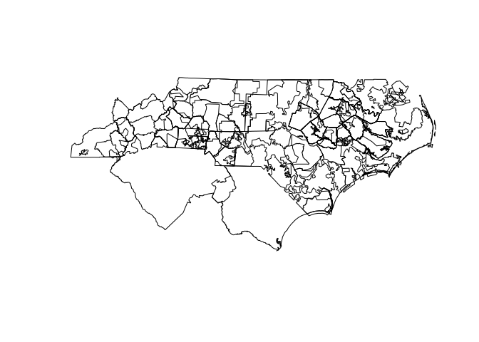

Introduction
============

Acquiring Data
==============

``` r
# https://hifld-geoplatform.opendata.arcgis.com/datasets/c4fd0b01c2544a2f83440dab292f0980_0
erst_name <- "Electric_Retail_Service_Territories"

url_list <- list(
  "csv" = "https://opendata.arcgis.com/datasets/c4fd0b01c2544a2f83440dab292f0980_0.csv?outSR=%7B%22latestWkid%22%3A3857%2C%22wkid%22%3A102100%7D",
  "kml" = "https://opendata.arcgis.com/datasets/c4fd0b01c2544a2f83440dab292f0980_0.kml?outSR=%7B%22latestWkid%22%3A3857%2C%22wkid%22%3A102100%7D",
  "zip" = "https://opendata.arcgis.com/datasets/c4fd0b01c2544a2f83440dab292f0980_0.zip?outSR=%7B%22latestWkid%22%3A3857%2C%22wkid%22%3A102100%7D",
  "gdb" = "https://opendata.arcgis.com/datasets/c4fd0b01c2544a2f83440dab292f0980_0.gdb?outSR=%7B%22latestWkid%22%3A3857%2C%22wkid%22%3A102100%7D")

for (i in 1:length(url_list)){
  file_name <- names(url_list)[i]
  data_url <- url_list[[file_name]]
  desired_name <- paste0(erst_name,".",file_name)
  desired_path <- file.path(desired_name)
  
  if (!file.exists(desired_path)){
    print(paste0("Downloading ",desired_name))
    download.file(data_url,desired_path)
    if (file_name=="zip"){
      unzip(desired_path)
    }
  }
}
```

``` r
data_shp <- st_read(paste0(erst_name,".shp"))
```

    ## Reading layer `Electric_Retail_Service_Territories' from data source `/home/ubuntu/environment/PLAN_672/leroi/Electric_Retail_Service_Territories.shp' using driver `ESRI Shapefile'
    ## Simple feature collection with 2947 features and 36 fields
    ## geometry type:  MULTIPOLYGON
    ## dimension:      XY
    ## bbox:           xmin: -178.3067 ymin: -14.60181 xmax: 145.9094 ymax: 71.38961
    ## epsg (SRID):    4326
    ## proj4string:    +proj=longlat +datum=WGS84 +no_defs

``` r
# https://gis.stackexchange.com/questions/64654/choosing-the-correct-value-for-proj4string-for-shapefile-reading-in-r
#shp <- st_transform(shp, "+init=epsg:3857")

summary(data_shp)
```

    ##     OBJECTID            ID                                  NAME     
    ##  Min.   :   1.0   1000   :   1   TRI-COUNTY ELECTRIC COOP, INC:   5  
    ##  1st Qu.: 737.5   10000  :   1   TRI-COUNTY ELEC MEMBER CORP  :   3  
    ##  Median :1474.0   10005  :   1   CITY OF HOPE                 :   2  
    ##  Mean   :1474.0   10009  :   1   NORTH CENTRAL ELEC COOP, INC :   2  
    ##  3rd Qu.:2210.5   10012  :   1   TOWN OF CLAYTON              :   2  
    ##  Max.   :2947.0   10019  :   1   4-COUNTY ELECTRIC POWER ASSN :   1  
    ##                   (Other):2941   (Other)                      :2932  
    ##                  ADDRESS                CITY          STATE     
    ##  NOT AVAILABLE       :1700   NOT AVAILABLE:1616   IA     : 175  
    ##  1 RIVERSIDE PLAZA   :   4   COLUMBUS     :   9   MN     : 170  
    ##  1002 HARBOR HILLS DR:   2   SPRINGFIELD  :   7   NE     : 153  
    ##  150 COOPERATIVE WAY :   2   JACKSON      :   6   KS     : 150  
    ##  2 SOUTH MAIN STREET :   2   ANCHORAGE    :   4   TX     : 140  
    ##  212 E. 6TH STREET   :   2   BURLINGTON   :   4   MO     : 128  
    ##  (Other)             :1235   (Other)      :1301   (Other):2031  
    ##             ZIP                TELEPHONE                       TYPE     
    ##  NOT AVAILABLE:1697   NOT AVAILABLE :1925   MUNICIPAL            :1837  
    ##  43215        :   4   (208) 263-5141:   2   COOPERATIVE          : 816  
    ##  49855        :   3   (253) 581-1912:   2   INVESTOR OWNED       : 173  
    ##  68602        :   3   (308) 352-4356:   2   POLITICAL SUBDIVISION:  92  
    ##  73083        :   3   (308) 762-1311:   2   STATE                :  13  
    ##  82435        :   3   (406) 348-3411:   2   NOT AVAILABLE        :   7  
    ##  (Other)      :1234   (Other)       :1012   (Other)              :   9  
    ##  COUNTRY    NAICS_CODE 
    ##  CAN:  11   2211:2947  
    ##  USA:2936              
    ##                        
    ##                        
    ##                        
    ##                        
    ##                        
    ##                                                     NAICS_DESC  
    ##  ELECTRIC POWER GENERATION, TRANSMISSION AND DISTRIBUTION:2947  
    ##                                                                 
    ##                                                                 
    ##                                                                 
    ##                                                                 
    ##                                                                 
    ##                                                                 
    ##                                                                                 SOURCE    
    ##  EIA 861, TIGER/Line Shapefiles - U.S. Census                                      : 766  
    ##  EIA 861, Urban Areas - Cartographic Boundary Shapefiles - U.S. Census             : 243  
    ##  EIA 860, EIA 861, TIGER/Line Shapefiles - U.S. Census                             : 219  
    ##  FERC 714, EIA 861, TIGER/Line Shapefiles - U.S. Census                            : 151  
    ##  EIA 861, https://www.tva.gov/file_source/TVA/Site%20Content/Energy/tva_lpc_map.pdf: 145  
    ##  EIA 860, EIA 861, Urban Areas - Cartographic Boundary Shapefiles - U.S. Census    : 127  
    ##  (Other)                                                                           :1296  
    ##                     SOURCEDATE   VAL_METHOD                       VAL_DATE   
    ##  2015-09-29T00:00:00.000Z:   2   OTHER:2947   2018-10-12T00:00:00.000Z:2316  
    ##  2015-09-30T00:00:00.000Z:  12                2019-05-01T00:00:00.000Z: 581  
    ##  2015-10-22T00:00:00.000Z:   4                2017-11-06T00:00:00.000Z:  26  
    ##  2017-04-17T00:00:00.000Z:   4                2015-09-30T00:00:00.000Z:  12  
    ##  2017-11-06T00:00:00.000Z:  29                2015-10-22T00:00:00.000Z:   4  
    ##  2018-10-12T00:00:00.000Z:2867                2017-04-17T00:00:00.000Z:   4  
    ##  2019-05-01T00:00:00.000Z:  29                (Other)                 :   4  
    ##                   WEBSITE             REGULATED   
    ##  NOT AVAILABLE        :1849   NOT AVAILABLE:2273  
    ##  http://www.edison.com:   5   REGULATED    : 674  
    ##  http://unitil.com/   :   2                       
    ##  http://www.nli-coop/ :   2                       
    ##  http://www.ucemc.com/:   2                       
    ##  http://www.uns.com/  :   2                       
    ##  (Other)              :1085                       
    ##                                                         CNTRL_AREA 
    ##  MIDCONTINENT INDEPENDENT TRANSMISSION SYSTEM OPERATOR, INC..:763  
    ##  SOUTHWEST POWER POOL                                        :530  
    ##  PJM INTERCONNECTION, LLC                                    :310  
    ##  TENNESSEE VALLEY AUTHORITY                                  :156  
    ##  SOUTHERN COMPANY SERVICES, INC. - TRANS                     :111  
    ##  ELECTRIC RELIABILITY COUNCIL OF TEXAS, INC.                 :107  
    ##  (Other)                                                     :970  
    ##                                   PLAN_AREA   
    ##  NOT AVAILABLE                         :2105  
    ##  BONNEVILLE POWER ADMINISTRATION, USDOE: 126  
    ##  ERCOT                                 :  93  
    ##  TRI-STATE G & T ASSN., INC.           :  57  
    ##  WISCONSIN PUBLIC POWER INC.           :  41  
    ##  CALIFORNIA INDEPENDENT SYSTEM OPERATOR:  35  
    ##  (Other)                               : 490  
    ##                          HOLDING_CO     SUMMR_PEAK          WINTR_PEAK       
    ##  FIRSTENERGY CORP             :  10   Min.   :-999999.0   Min.   :-999999.0  
    ##  AMERICAN ELECTRIC POWER CO   :   9   1st Qu.:-999999.0   1st Qu.:-999999.0  
    ##  DUKE ENERGY CORP             :   6   Median :     21.0   Median :     19.0  
    ##  ENTERGY CORP                 :   6   Mean   :-372646.0   Mean   :-373024.3  
    ##  TRI-COUNTY ELECTRIC COOP, INC:   5   3rd Qu.:     80.9   3rd Qu.:     76.9  
    ##  EDISON INTERNATIONAL         :   4   Max.   :  25343.0   Max.   :  18126.0  
    ##  (Other)                      :2907                                          
    ##    SUMMER_CAP        WINTER_CAP         NET_GEN            PURCHASED       
    ##  Min.   :-999999   Min.   :-999999   Min.   :  -999999   Min.   : -999999  
    ##  1st Qu.:-999999   1st Qu.:-999999   1st Qu.:  -999999   1st Qu.: -999999  
    ##  Median :-999999   Median :-999999   Median :  -999999   Median :  101163  
    ##  Mean   :-784028   Mean   :-784710   Mean   :   -91953   Mean   :  238928  
    ##  3rd Qu.:-999999   3rd Qu.:-999999   3rd Qu.:        0   3rd Qu.:  375236  
    ##  Max.   :  38737   Max.   :  40192   Max.   :119906645   Max.   :70078621  
    ##                                                                            
    ##      NET_EX          RETAIL_MWH          WSALE_MWH          TOTAL_MWH        
    ##  Min.   :-999999   Min.   :  -999999   Min.   : -999999   Min.   :  -999999  
    ##  1st Qu.:-999999   1st Qu.:    21629   1st Qu.: -999999   1st Qu.:  -999999  
    ##  Median :      0   Median :    99018   Median : -999999   Median :   106372  
    ##  Mean   :-392661   Mean   :   977679   Mean   : -554484   Mean   :   891039  
    ##  3rd Qu.:      0   3rd Qu.:   364211   3rd Qu.: -999999   3rd Qu.:   395436  
    ##  Max.   :2873675   Max.   :108513594   Max.   :87984007   Max.   :123985212  
    ##                                                                              
    ##    TRANS_MWH         CUSTOMERS                  YEAR        SHAPE__Are       
    ##  Min.   :-999999   Min.   :-999999   2016         :  29   Min.   :1.470e+05  
    ##  1st Qu.:-999999   1st Qu.:   1140   2017         :2896   1st Qu.:1.907e+08  
    ##  Median :      0   Median :   4272   NOT AVAILABLE:  22   Median :2.865e+09  
    ##  Mean   :-393476   Mean   :  39271                        Mean   :2.513e+10  
    ##  3rd Qu.:      0   3rd Qu.:  15588                        3rd Qu.:7.039e+09  
    ##  Max.   :1247509   Max.   :5479894                        Max.   :4.183e+12  
    ##                                                                              
    ##    SHAPE__Len                geometry   
    ##  Min.   :    1591   MULTIPOLYGON :2947  
    ##  1st Qu.:  129901   epsg:4326    :   0  
    ##  Median :  269942   +proj=long...:   0  
    ##  Mean   :  674098                       
    ##  3rd Qu.:  555167                       
    ##  Max.   :45429543                       
    ## 

``` r
str(data_shp)
```

    ## Classes 'sf' and 'data.frame':   2947 obs. of  37 variables:
    ##  $ OBJECTID  : int  1001 1002 1003 1004 1005 1006 1007 1008 1009 1010 ...
    ##  $ ID        : Factor w/ 2947 levels "1000","10000",..: 692 77 2014 1003 251 2549 1533 689 38 847 ...
    ##  $ NAME      : Factor w/ 2938 levels "4-COUNTY ELECTRIC POWER ASSN",..: 1070 810 464 1184 324 647 1380 1069 804 345 ...
    ##  $ ADDRESS   : Factor w/ 1230 levels "04125 STATE ROUTE 576",..: 896 1099 730 1106 1169 1103 1169 832 632 1160 ...
    ##  $ CITY      : Factor w/ 1093 levels "ABBEVILLE","ABERDEEN",..: 761 536 193 879 60 357 1041 760 523 91 ...
    ##  $ STATE     : Factor w/ 58 levels "AB","AK","AL",..: 21 21 21 21 21 21 21 21 21 21 ...
    ##  $ ZIP       : Factor w/ 1173 levels "00936","01011",..: 641 677 669 684 638 640 648 646 661 668 ...
    ##  $ TELEPHONE : Factor w/ 1012 levels "(202) 690-7442",..: 1012 1012 1012 1012 1012 1012 1012 1012 1012 1012 ...
    ##  $ TYPE      : Factor w/ 9 levels "COOPERATIVE",..: 4 4 4 4 4 4 4 4 4 4 ...
    ##  $ COUNTRY   : Factor w/ 2 levels "CAN","USA": 2 2 2 2 2 2 2 2 2 2 ...
    ##  $ NAICS_CODE: Factor w/ 1 level "2211": 1 1 1 1 1 1 1 1 1 1 ...
    ##  $ NAICS_DESC: Factor w/ 1 level "ELECTRIC POWER GENERATION, TRANSMISSION AND DISTRIBUTION": 1 1 1 1 1 1 1 1 1 1 ...
    ##  $ SOURCE    : Factor w/ 284 levels "California Energy Commission",..: 44 44 44 44 44 44 44 44 44 44 ...
    ##  $ SOURCEDATE: Factor w/ 7 levels "2015-09-29T00:00:00.000Z",..: 6 6 6 6 6 6 6 6 6 6 ...
    ##  $ VAL_METHOD: Factor w/ 1 level "OTHER": 1 1 1 1 1 1 1 1 1 1 ...
    ##  $ VAL_DATE  : Factor w/ 9 levels "2015-09-29T00:00:00.000Z",..: 8 8 8 8 8 8 8 8 8 8 ...
    ##  $ WEBSITE   : Factor w/ 1088 levels "bentcounty.org/las-animas-about/",..: 919 919 919 919 919 919 919 919 919 919 ...
    ##  $ REGULATED : Factor w/ 2 levels "NOT AVAILABLE",..: 1 1 1 1 1 1 1 1 1 1 ...
    ##  $ CNTRL_AREA: Factor w/ 62 levels "ANCHORAGE MUNICIPAL LIGHT & POWER",..: 54 54 54 54 54 54 54 54 54 54 ...
    ##  $ PLAN_AREA : Factor w/ 103 levels "ALABAMA POWER COMPANY",..: 60 60 60 60 60 60 60 60 60 60 ...
    ##  $ HOLDING_CO: Factor w/ 2878 levels "4-COUNTY ELECTRIC POWER ASSN",..: 1036 788 458 1145 328 631 1332 1035 782 347 ...
    ##  $ SUMMR_PEAK: num  8.5 -999999 17.3 24.9 9 ...
    ##  $ WINTR_PEAK: num  6.8 -999999 8.6 17.6 5.5 ...
    ##  $ SUMMER_CAP: num  11.6 4.6 29.7 26.4 8.9 10.2 14.5 11.5 18 16.8 ...
    ##  $ WINTER_CAP: num  11.6 4.6 29.7 30.2 8.9 10.2 15.2 11.5 18.2 16.8 ...
    ##  $ NET_GEN   : int  171 -999999 144 235 223 23 -676 -1023 3182 151 ...
    ##  $ PURCHASED : int  33833 -999999 49877 119925 33717 32469 50501 34366 43767 47825 ...
    ##  $ NET_EX    : int  0 -999999 0 0 0 0 0 0 0 0 ...
    ##  $ RETAIL_MWH: int  27389 10923 44148 106623 30691 25604 45089 31285 38825 41992 ...
    ##  $ WSALE_MWH : int  -999999 -999999 -999999 163 -999999 -999999 0 -999999 -999999 -999999 ...
    ##  $ TOTAL_MWH : int  34004 -999999 50021 120160 33940 29765 49825 33343 43190 47976 ...
    ##  $ TRANS_MWH : int  0 -999999 0 0 0 0 0 0 0 0 ...
    ##  $ CUSTOMERS : int  2082 890 2764 3385 1982 1822 2358 1560 1975 2317 ...
    ##  $ YEAR      : Factor w/ 3 levels "2016","2017",..: 2 2 2 2 2 2 2 2 2 2 ...
    ##  $ SHAPE__Are: num  9810024 9537604 9399764 8838890 8778268 ...
    ##  $ SHAPE__Len: num  25721 12653 24613 23456 19818 ...
    ##  $ geometry  :sfc_MULTIPOLYGON of length 2947; first list element: List of 3
    ##   ..$ :List of 1
    ##   .. ..$ : num [1:47, 1:2] -94.9 -94.9 -94.9 -94.9 -94.9 ...
    ##   ..$ :List of 1
    ##   .. ..$ : num [1:143, 1:2] -94.9 -94.9 -94.9 -94.9 -94.9 ...
    ##   ..$ :List of 1
    ##   .. ..$ : num [1:229, 1:2] -95 -95 -95 -95 -95 ...
    ##   ..- attr(*, "class")= chr  "XY" "MULTIPOLYGON" "sfg"
    ##  - attr(*, "sf_column")= chr "geometry"
    ##  - attr(*, "agr")= Factor w/ 3 levels "constant","aggregate",..: NA NA NA NA NA NA NA NA NA NA ...
    ##   ..- attr(*, "names")= chr  "OBJECTID" "ID" "NAME" "ADDRESS" ...

``` r
plot(data_shp$geometry)
```


``` r
data <- data_shp %>% st_drop_geometry()

str(data)
```

    ## 'data.frame':    2947 obs. of  36 variables:
    ##  $ OBJECTID  : int  1001 1002 1003 1004 1005 1006 1007 1008 1009 1010 ...
    ##  $ ID        : Factor w/ 2947 levels "1000","10000",..: 692 77 2014 1003 251 2549 1533 689 38 847 ...
    ##  $ NAME      : Factor w/ 2938 levels "4-COUNTY ELECTRIC POWER ASSN",..: 1070 810 464 1184 324 647 1380 1069 804 345 ...
    ##  $ ADDRESS   : Factor w/ 1230 levels "04125 STATE ROUTE 576",..: 896 1099 730 1106 1169 1103 1169 832 632 1160 ...
    ##  $ CITY      : Factor w/ 1093 levels "ABBEVILLE","ABERDEEN",..: 761 536 193 879 60 357 1041 760 523 91 ...
    ##  $ STATE     : Factor w/ 58 levels "AB","AK","AL",..: 21 21 21 21 21 21 21 21 21 21 ...
    ##  $ ZIP       : Factor w/ 1173 levels "00936","01011",..: 641 677 669 684 638 640 648 646 661 668 ...
    ##  $ TELEPHONE : Factor w/ 1012 levels "(202) 690-7442",..: 1012 1012 1012 1012 1012 1012 1012 1012 1012 1012 ...
    ##  $ TYPE      : Factor w/ 9 levels "COOPERATIVE",..: 4 4 4 4 4 4 4 4 4 4 ...
    ##  $ COUNTRY   : Factor w/ 2 levels "CAN","USA": 2 2 2 2 2 2 2 2 2 2 ...
    ##  $ NAICS_CODE: Factor w/ 1 level "2211": 1 1 1 1 1 1 1 1 1 1 ...
    ##  $ NAICS_DESC: Factor w/ 1 level "ELECTRIC POWER GENERATION, TRANSMISSION AND DISTRIBUTION": 1 1 1 1 1 1 1 1 1 1 ...
    ##  $ SOURCE    : Factor w/ 284 levels "California Energy Commission",..: 44 44 44 44 44 44 44 44 44 44 ...
    ##  $ SOURCEDATE: Factor w/ 7 levels "2015-09-29T00:00:00.000Z",..: 6 6 6 6 6 6 6 6 6 6 ...
    ##  $ VAL_METHOD: Factor w/ 1 level "OTHER": 1 1 1 1 1 1 1 1 1 1 ...
    ##  $ VAL_DATE  : Factor w/ 9 levels "2015-09-29T00:00:00.000Z",..: 8 8 8 8 8 8 8 8 8 8 ...
    ##  $ WEBSITE   : Factor w/ 1088 levels "bentcounty.org/las-animas-about/",..: 919 919 919 919 919 919 919 919 919 919 ...
    ##  $ REGULATED : Factor w/ 2 levels "NOT AVAILABLE",..: 1 1 1 1 1 1 1 1 1 1 ...
    ##  $ CNTRL_AREA: Factor w/ 62 levels "ANCHORAGE MUNICIPAL LIGHT & POWER",..: 54 54 54 54 54 54 54 54 54 54 ...
    ##  $ PLAN_AREA : Factor w/ 103 levels "ALABAMA POWER COMPANY",..: 60 60 60 60 60 60 60 60 60 60 ...
    ##  $ HOLDING_CO: Factor w/ 2878 levels "4-COUNTY ELECTRIC POWER ASSN",..: 1036 788 458 1145 328 631 1332 1035 782 347 ...
    ##  $ SUMMR_PEAK: num  8.5 -999999 17.3 24.9 9 ...
    ##  $ WINTR_PEAK: num  6.8 -999999 8.6 17.6 5.5 ...
    ##  $ SUMMER_CAP: num  11.6 4.6 29.7 26.4 8.9 10.2 14.5 11.5 18 16.8 ...
    ##  $ WINTER_CAP: num  11.6 4.6 29.7 30.2 8.9 10.2 15.2 11.5 18.2 16.8 ...
    ##  $ NET_GEN   : int  171 -999999 144 235 223 23 -676 -1023 3182 151 ...
    ##  $ PURCHASED : int  33833 -999999 49877 119925 33717 32469 50501 34366 43767 47825 ...
    ##  $ NET_EX    : int  0 -999999 0 0 0 0 0 0 0 0 ...
    ##  $ RETAIL_MWH: int  27389 10923 44148 106623 30691 25604 45089 31285 38825 41992 ...
    ##  $ WSALE_MWH : int  -999999 -999999 -999999 163 -999999 -999999 0 -999999 -999999 -999999 ...
    ##  $ TOTAL_MWH : int  34004 -999999 50021 120160 33940 29765 49825 33343 43190 47976 ...
    ##  $ TRANS_MWH : int  0 -999999 0 0 0 0 0 0 0 0 ...
    ##  $ CUSTOMERS : int  2082 890 2764 3385 1982 1822 2358 1560 1975 2317 ...
    ##  $ YEAR      : Factor w/ 3 levels "2016","2017",..: 2 2 2 2 2 2 2 2 2 2 ...
    ##  $ SHAPE__Are: num  9810024 9537604 9399764 8838890 8778268 ...
    ##  $ SHAPE__Len: num  25721 12653 24613 23456 19818 ...

Data Munging
============

Munging Steps:

-   Limit to North Carolina Utilities
-   Replace `-999999` with `NA`

Limit to NC Utilities
---------------------

For now I will limit by the state name of the serving utility. Soon, I
will select by those territories which overlap with the NC state
boundary.

``` r
data <- data[data$STATE=="NC",]
#plot(data_shp$geometry)
```

Replace `-999999` with `NA`
---------------------------

``` r
na_num_placeholder <- -999999.0

na_num_colnames <- c("SUMMR_PEAK",
             "WINTR_PEAK",
             "SUMMER_CAP",
             "WINTER_CAP",
             "NET_GEN",
             "PURCHASED",
             "NET_EX",
             "RETAIL_MWH",
             "WSALE_MWH",
             "TOTAL_MWH",
             "TRANS_MWH",
             "CUSTOMERS")

na_num_cols <- which(names(data) %in% na_num_colnames)

data[, na_num_cols][data[, na_num_cols] == na_num_placeholder] <- NA

summary(data[na_num_cols])
```

    ##    SUMMR_PEAK         WINTR_PEAK         SUMMER_CAP        WINTER_CAP     
    ##  Min.   :   20.20   Min.   :   18.00   Min.   :    2.4   Min.   :    2.4  
    ##  1st Qu.:   43.92   1st Qu.:   45.15   1st Qu.:    2.8   1st Qu.:    2.7  
    ##  Median :   90.90   Median :   92.50   Median :  225.0   Median :  265.0  
    ##  Mean   :  625.09   Mean   :  653.32   Mean   : 6919.9   Mean   : 7371.2  
    ##  3rd Qu.:  200.97   3rd Qu.:  205.65   3rd Qu.:12889.9   3rd Qu.:14116.9  
    ##  Max.   :17422.00   Max.   :16743.00   Max.   :21479.3   Max.   :22469.2  
    ##  NA's   :39         NA's   :39         NA's   :96        NA's   :96       
    ##     NET_GEN           PURCHASED           NET_EX         RETAIL_MWH      
    ##  Min.   :       0   Min.   : 101339   Min.   :     0   Min.   :    1663  
    ##  1st Qu.:       0   1st Qu.: 213970   1st Qu.:     0   1st Qu.:   43036  
    ##  Median :       0   Median : 400128   Median :     0   Median :  152352  
    ##  Mean   :13009446   Mean   : 953294   Mean   : 10421   Mean   : 1541878  
    ##  3rd Qu.:    4664   3rd Qu.: 907130   3rd Qu.:     0   3rd Qu.:  457973  
    ##  Max.   :81700915   Max.   :9478719   Max.   :646107   Max.   :77435296  
    ##  NA's   :90         NA's   :39        NA's   :39       NA's   :1         
    ##    WSALE_MWH          TOTAL_MWH          TRANS_MWH        CUSTOMERS      
    ##  Min.   :       0   Min.   :  101339   Min.   :     0   Min.   :    127  
    ##  1st Qu.:    1762   1st Qu.:  213970   1st Qu.:     0   1st Qu.:   1818  
    ##  Median :   21347   Median :  400128   Median :     0   Median :   5930  
    ##  Mean   : 3725764   Mean   : 3272573   Mean   :  2132   Mean   :  57722  
    ##  3rd Qu.: 3752530   3rd Qu.:  907213   3rd Qu.:     0   3rd Qu.:  25419  
    ##  Max.   :23552726   Max.   :91928462   Max.   :102721   Max.   :2557117  
    ##  NA's   :90         NA's   :39         NA's   :39       NA's   :1

Replace `NOT AVAILABLE` with `NA`
---------------------------------

``` r
na_txt_placeholder <- "NOT AVAILABLE"

na_txt_colnames <- c("REGULATED",
               "CNTRL_AREA",
               "PLAN_AREA",
               "HOLDING_CO")

na_txt_cols <- which(names(data) %in% na_txt_colnames)

data[, na_txt_cols][data[, na_txt_cols] == na_txt_placeholder] <- NA

summary(data[na_txt_cols])
```

    ##          REGULATED                              CNTRL_AREA
    ##  NOT AVAILABLE: 0   DUKE ENERGY PROGRESS EAST        :55  
    ##  REGULATED    :24   DUKE ENERGY CAROLINAS            :34  
    ##  NA's         :77   PJM INTERCONNECTION, LLC         :10  
    ##                     TENNESSEE VALLEY AUTHORITY       : 1  
    ##                     ANCHORAGE MUNICIPAL LIGHT & POWER: 0  
    ##                     (Other)                          : 0  
    ##                     NA's                             : 1  
    ##                                             PLAN_AREA 
    ##  PROGRESS ENERGY (CAROLINA POWER & LIGHT COMPANY):10  
    ##  DUKE ENERGY CAROLINAS, LLC                      : 7  
    ##  GREENVILLE UTILITIES COMMISSION                 : 1  
    ##  OGLETHORPE POWER COMPANY                        : 1  
    ##  ALABAMA POWER COMPANY                           : 0  
    ##  (Other)                                         : 0  
    ##  NA's                                            :82  
    ##                               HOLDING_CO
    ##  DUKE ENERGY CORP                  : 2  
    ##  ALBEMARLE ELECTRIC MEMBER CORP    : 1  
    ##  BLUE RIDGE ELEC MEMBER CORP - (NC): 1  
    ##  BRUNSWICK ELECTRIC MEMBER CORP    : 1  
    ##  CAPE HATTERAS ELEC MEMBER CORP    : 1  
    ##  CARTERET-CRAVEN EL MEMBER CORP    : 1  
    ##  (Other)                           :94

``` r
keep_cols <- c("OBJECTID",
               "ID",
               "NAME",
               "TYPE",
               na_txt_colnames,
               na_num_colnames)

data <- data[keep_cols]
```

``` r
final_data <- left_join(data, data_shp[c("OBJECTID","geometry")], by="OBJECTID")

summary(final_data)
```

    ##     OBJECTID          ID                                           NAME   
    ##  Min.   :1602   10324  : 1   ALBEMARLE ELECTRIC MEMBER CORP          : 1  
    ##  1st Qu.:1627   10345  : 1   BLUE RIDGE ELEC MEMBER CORP - (NC)      : 1  
    ##  Median :1652   1036   : 1   BRUNSWICK ELECTRIC MEMBER CORP          : 1  
    ##  Mean   :1652   10586  : 1   CAPE HATTERAS ELEC MEMBER CORP          : 1  
    ##  3rd Qu.:1677   10669  : 1   CARTERET-CRAVEN EL MEMBER CORP          : 1  
    ##  Max.   :1702   10770  : 1   CENTRAL ELECTRIC MEMBERSHIP CORP. - (NC): 1  
    ##                 (Other):95   (Other)                                 :95  
    ##                        TYPE            REGULATED 
    ##  MUNICIPAL               :71   NOT AVAILABLE: 0  
    ##  COOPERATIVE             :26   REGULATED    :24  
    ##  INVESTOR OWNED          : 2   NA's         :77  
    ##  MUNICIPAL MKTG AUTHORITY: 1                     
    ##  STATE                   : 1                     
    ##  FEDERAL                 : 0                     
    ##  (Other)                 : 0                     
    ##                              CNTRL_AREA
    ##  DUKE ENERGY PROGRESS EAST        :55  
    ##  DUKE ENERGY CAROLINAS            :34  
    ##  PJM INTERCONNECTION, LLC         :10  
    ##  TENNESSEE VALLEY AUTHORITY       : 1  
    ##  ANCHORAGE MUNICIPAL LIGHT & POWER: 0  
    ##  (Other)                          : 0  
    ##  NA's                             : 1  
    ##                                             PLAN_AREA 
    ##  PROGRESS ENERGY (CAROLINA POWER & LIGHT COMPANY):10  
    ##  DUKE ENERGY CAROLINAS, LLC                      : 7  
    ##  GREENVILLE UTILITIES COMMISSION                 : 1  
    ##  OGLETHORPE POWER COMPANY                        : 1  
    ##  ALABAMA POWER COMPANY                           : 0  
    ##  (Other)                                         : 0  
    ##  NA's                                            :82  
    ##                               HOLDING_CO   SUMMR_PEAK         WINTR_PEAK      
    ##  DUKE ENERGY CORP                  : 2   Min.   :   20.20   Min.   :   18.00  
    ##  ALBEMARLE ELECTRIC MEMBER CORP    : 1   1st Qu.:   43.92   1st Qu.:   45.15  
    ##  BLUE RIDGE ELEC MEMBER CORP - (NC): 1   Median :   90.90   Median :   92.50  
    ##  BRUNSWICK ELECTRIC MEMBER CORP    : 1   Mean   :  625.09   Mean   :  653.32  
    ##  CAPE HATTERAS ELEC MEMBER CORP    : 1   3rd Qu.:  200.97   3rd Qu.:  205.65  
    ##  CARTERET-CRAVEN EL MEMBER CORP    : 1   Max.   :17422.00   Max.   :16743.00  
    ##  (Other)                           :94   NA's   :39         NA's   :39        
    ##    SUMMER_CAP        WINTER_CAP         NET_GEN           PURCHASED      
    ##  Min.   :    2.4   Min.   :    2.4   Min.   :       0   Min.   : 101339  
    ##  1st Qu.:    2.8   1st Qu.:    2.7   1st Qu.:       0   1st Qu.: 213970  
    ##  Median :  225.0   Median :  265.0   Median :       0   Median : 400128  
    ##  Mean   : 6919.9   Mean   : 7371.2   Mean   :13009446   Mean   : 953294  
    ##  3rd Qu.:12889.9   3rd Qu.:14116.9   3rd Qu.:    4664   3rd Qu.: 907130  
    ##  Max.   :21479.3   Max.   :22469.2   Max.   :81700915   Max.   :9478719  
    ##  NA's   :96        NA's   :96        NA's   :90         NA's   :39       
    ##      NET_EX         RETAIL_MWH         WSALE_MWH          TOTAL_MWH       
    ##  Min.   :     0   Min.   :    1663   Min.   :       0   Min.   :  101339  
    ##  1st Qu.:     0   1st Qu.:   43036   1st Qu.:    1762   1st Qu.:  213970  
    ##  Median :     0   Median :  152352   Median :   21347   Median :  400128  
    ##  Mean   : 10421   Mean   : 1541878   Mean   : 3725764   Mean   : 3272573  
    ##  3rd Qu.:     0   3rd Qu.:  457973   3rd Qu.: 3752530   3rd Qu.:  907213  
    ##  Max.   :646107   Max.   :77435296   Max.   :23552726   Max.   :91928462  
    ##  NA's   :39       NA's   :1          NA's   :90         NA's   :39        
    ##    TRANS_MWH        CUSTOMERS                geometry  
    ##  Min.   :     0   Min.   :    127   MULTIPOLYGON :101  
    ##  1st Qu.:     0   1st Qu.:   1818   epsg:4326    :  0  
    ##  Median :     0   Median :   5930   +proj=long...:  0  
    ##  Mean   :  2132   Mean   :  57722                      
    ##  3rd Qu.:     0   3rd Qu.:  25419                      
    ##  Max.   :102721   Max.   :2557117                      
    ##  NA's   :39       NA's   :1

``` r
plot(final_data$geometry)
```



Questions
=========

-   What percent of the state’s land/customers/load is served by these
    territories
-   What percent of the state’s land/customers/load is served by
    Investor Owned Utilities, Cooperatives, or Municipal Providers
