Introduction
============

Acquiring Data
==============

``` r
# https://hifld-geoplatform.opendata.arcgis.com/datasets/c4fd0b01c2544a2f83440dab292f0980_0
erst_name <- "Electric_Retail_Service_Territories"

url_list <- list(
  "csv" = "https://opendata.arcgis.com/datasets/c4fd0b01c2544a2f83440dab292f0980_0.csv?outSR=%7B%22latestWkid%22%3A3857%2C%22wkid%22%3A102100%7D",
  "kml" = "https://opendata.arcgis.com/datasets/c4fd0b01c2544a2f83440dab292f0980_0.kml?outSR=%7B%22latestWkid%22%3A3857%2C%22wkid%22%3A102100%7D",
  "zip" = "https://opendata.arcgis.com/datasets/c4fd0b01c2544a2f83440dab292f0980_0.zip?outSR=%7B%22latestWkid%22%3A3857%2C%22wkid%22%3A102100%7D",
  "gdb" = "https://opendata.arcgis.com/datasets/c4fd0b01c2544a2f83440dab292f0980_0.gdb?outSR=%7B%22latestWkid%22%3A3857%2C%22wkid%22%3A102100%7D")

for (i in 1:length(url_list)){
  file_name <- names(url_list)[i]
  data_url <- url_list[[file_name]]
  desired_name <- paste0(erst_name,".",file_name)
  desired_path <- file.path(desired_name)
  
  if (!file.exists(desired_path)){
    print(paste0("Downloading ",desired_name))
    download.file(data_url,desired_path)
    if (file_name=="zip"){
      unzip(desired_path)
    }
  }
}
```

``` r
data_shp <- st_read(paste0(erst_name,".shp"))
```

    ## Reading layer `Electric_Retail_Service_Territories' from data source `/home/ubuntu/environment/leroi/Electric_Retail_Service_Territories.shp' using driver `ESRI Shapefile'
    ## Simple feature collection with 2947 features and 36 fields
    ## geometry type:  MULTIPOLYGON
    ## dimension:      XY
    ## bbox:           xmin: -178.3067 ymin: -14.60181 xmax: 145.9094 ymax: 71.38961
    ## CRS:            4326

``` r
# https://gis.stackexchange.com/questions/64654/choosing-the-correct-value-for-proj4string-for-shapefile-reading-in-r
#shp <- st_transform(shp, "+init=epsg:3857")

summary(data_shp)
```

    ##     OBJECTID            ID                                  NAME     
    ##  Min.   :   1.0   1000   :   1   TRI-COUNTY ELECTRIC COOP, INC:   5  
    ##  1st Qu.: 737.5   10000  :   1   TRI-COUNTY ELEC MEMBER CORP  :   3  
    ##  Median :1474.0   10005  :   1   CITY OF HOPE                 :   2  
    ##  Mean   :1474.0   10009  :   1   NORTH CENTRAL ELEC COOP, INC :   2  
    ##  3rd Qu.:2210.5   10012  :   1   TOWN OF CLAYTON              :   2  
    ##  Max.   :2947.0   10019  :   1   4-COUNTY ELECTRIC POWER ASSN :   1  
    ##                   (Other):2941   (Other)                      :2932  
    ##                  ADDRESS                CITY          STATE     
    ##  NOT AVAILABLE       :1700   NOT AVAILABLE:1616   IA     : 175  
    ##  1 RIVERSIDE PLAZA   :   4   COLUMBUS     :   9   MN     : 170  
    ##  1002 HARBOR HILLS DR:   2   SPRINGFIELD  :   7   NE     : 153  
    ##  150 COOPERATIVE WAY :   2   JACKSON      :   6   KS     : 150  
    ##  2 SOUTH MAIN STREET :   2   ANCHORAGE    :   4   TX     : 140  
    ##  212 E. 6TH STREET   :   2   BURLINGTON   :   4   MO     : 128  
    ##  (Other)             :1235   (Other)      :1301   (Other):2031  
    ##             ZIP                TELEPHONE                       TYPE     
    ##  NOT AVAILABLE:1697   NOT AVAILABLE :1925   MUNICIPAL            :1837  
    ##  43215        :   4   (208) 263-5141:   2   COOPERATIVE          : 816  
    ##  49855        :   3   (253) 581-1912:   2   INVESTOR OWNED       : 173  
    ##  68602        :   3   (308) 352-4356:   2   POLITICAL SUBDIVISION:  92  
    ##  73083        :   3   (308) 762-1311:   2   STATE                :  13  
    ##  82435        :   3   (406) 348-3411:   2   NOT AVAILABLE        :   7  
    ##  (Other)      :1234   (Other)       :1012   (Other)              :   9  
    ##  COUNTRY    NAICS_CODE 
    ##  CAN:  11   2211:2947  
    ##  USA:2936              
    ##                        
    ##                        
    ##                        
    ##                        
    ##                        
    ##                                                     NAICS_DESC  
    ##  ELECTRIC POWER GENERATION, TRANSMISSION AND DISTRIBUTION:2947  
    ##                                                                 
    ##                                                                 
    ##                                                                 
    ##                                                                 
    ##                                                                 
    ##                                                                 
    ##                                                                                 SOURCE    
    ##  EIA 861, TIGER/Line Shapefiles - U.S. Census                                      : 766  
    ##  EIA 861, Urban Areas - Cartographic Boundary Shapefiles - U.S. Census             : 243  
    ##  EIA 860, EIA 861, TIGER/Line Shapefiles - U.S. Census                             : 219  
    ##  FERC 714, EIA 861, TIGER/Line Shapefiles - U.S. Census                            : 151  
    ##  EIA 861, https://www.tva.gov/file_source/TVA/Site%20Content/Energy/tva_lpc_map.pdf: 145  
    ##  EIA 860, EIA 861, Urban Areas - Cartographic Boundary Shapefiles - U.S. Census    : 127  
    ##  (Other)                                                                           :1296  
    ##                     SOURCEDATE   VAL_METHOD                       VAL_DATE   
    ##  2015-09-29T00:00:00.000Z:   2   OTHER:2947   2018-10-12T00:00:00.000Z:2316  
    ##  2015-09-30T00:00:00.000Z:  12                2019-05-01T00:00:00.000Z: 581  
    ##  2015-10-22T00:00:00.000Z:   4                2017-11-06T00:00:00.000Z:  26  
    ##  2017-04-17T00:00:00.000Z:   4                2015-09-30T00:00:00.000Z:  12  
    ##  2017-11-06T00:00:00.000Z:  29                2015-10-22T00:00:00.000Z:   4  
    ##  2018-10-12T00:00:00.000Z:2867                2017-04-17T00:00:00.000Z:   4  
    ##  2019-05-01T00:00:00.000Z:  29                (Other)                 :   4  
    ##                   WEBSITE             REGULATED   
    ##  NOT AVAILABLE        :1849   NOT AVAILABLE:2273  
    ##  http://www.edison.com:   5   REGULATED    : 674  
    ##  http://unitil.com/   :   2                       
    ##  http://www.nli-coop/ :   2                       
    ##  http://www.ucemc.com/:   2                       
    ##  http://www.uns.com/  :   2                       
    ##  (Other)              :1085                       
    ##                                                         CNTRL_AREA 
    ##  MIDCONTINENT INDEPENDENT TRANSMISSION SYSTEM OPERATOR, INC..:763  
    ##  SOUTHWEST POWER POOL                                        :530  
    ##  PJM INTERCONNECTION, LLC                                    :310  
    ##  TENNESSEE VALLEY AUTHORITY                                  :156  
    ##  SOUTHERN COMPANY SERVICES, INC. - TRANS                     :111  
    ##  ELECTRIC RELIABILITY COUNCIL OF TEXAS, INC.                 :107  
    ##  (Other)                                                     :970  
    ##                                   PLAN_AREA   
    ##  NOT AVAILABLE                         :2105  
    ##  BONNEVILLE POWER ADMINISTRATION, USDOE: 126  
    ##  ERCOT                                 :  93  
    ##  TRI-STATE G & T ASSN., INC.           :  57  
    ##  WISCONSIN PUBLIC POWER INC.           :  41  
    ##  CALIFORNIA INDEPENDENT SYSTEM OPERATOR:  35  
    ##  (Other)                               : 490  
    ##                          HOLDING_CO     SUMMR_PEAK          WINTR_PEAK       
    ##  FIRSTENERGY CORP             :  10   Min.   :-999999.0   Min.   :-999999.0  
    ##  AMERICAN ELECTRIC POWER CO   :   9   1st Qu.:-999999.0   1st Qu.:-999999.0  
    ##  DUKE ENERGY CORP             :   6   Median :     21.0   Median :     19.0  
    ##  ENTERGY CORP                 :   6   Mean   :-372646.0   Mean   :-373024.3  
    ##  TRI-COUNTY ELECTRIC COOP, INC:   5   3rd Qu.:     80.9   3rd Qu.:     76.9  
    ##  EDISON INTERNATIONAL         :   4   Max.   :  25343.0   Max.   :  18126.0  
    ##  (Other)                      :2907                                          
    ##    SUMMER_CAP        WINTER_CAP         NET_GEN            PURCHASED       
    ##  Min.   :-999999   Min.   :-999999   Min.   :  -999999   Min.   : -999999  
    ##  1st Qu.:-999999   1st Qu.:-999999   1st Qu.:  -999999   1st Qu.: -999999  
    ##  Median :-999999   Median :-999999   Median :  -999999   Median :  101163  
    ##  Mean   :-784028   Mean   :-784710   Mean   :   -91953   Mean   :  238928  
    ##  3rd Qu.:-999999   3rd Qu.:-999999   3rd Qu.:        0   3rd Qu.:  375236  
    ##  Max.   :  38737   Max.   :  40192   Max.   :119906645   Max.   :70078621  
    ##                                                                            
    ##      NET_EX          RETAIL_MWH          WSALE_MWH          TOTAL_MWH        
    ##  Min.   :-999999   Min.   :  -999999   Min.   : -999999   Min.   :  -999999  
    ##  1st Qu.:-999999   1st Qu.:    21629   1st Qu.: -999999   1st Qu.:  -999999  
    ##  Median :      0   Median :    99018   Median : -999999   Median :   106372  
    ##  Mean   :-392661   Mean   :   977679   Mean   : -554484   Mean   :   891039  
    ##  3rd Qu.:      0   3rd Qu.:   364211   3rd Qu.: -999999   3rd Qu.:   395436  
    ##  Max.   :2873675   Max.   :108513594   Max.   :87984007   Max.   :123985212  
    ##                                                                              
    ##    TRANS_MWH         CUSTOMERS                  YEAR        SHAPE__Are       
    ##  Min.   :-999999   Min.   :-999999   2016         :  29   Min.   :1.470e+05  
    ##  1st Qu.:-999999   1st Qu.:   1140   2017         :2896   1st Qu.:1.907e+08  
    ##  Median :      0   Median :   4272   NOT AVAILABLE:  22   Median :2.865e+09  
    ##  Mean   :-393476   Mean   :  39271                        Mean   :2.513e+10  
    ##  3rd Qu.:      0   3rd Qu.:  15588                        3rd Qu.:7.039e+09  
    ##  Max.   :1247509   Max.   :5479894                        Max.   :4.183e+12  
    ##                                                                              
    ##    SHAPE__Len                geometry   
    ##  Min.   :    1591   MULTIPOLYGON :2947  
    ##  1st Qu.:  129901   epsg:4326    :   0  
    ##  Median :  269942   +proj=long...:   0  
    ##  Mean   :  674098                       
    ##  3rd Qu.:  555167                       
    ##  Max.   :45429543                       
    ## 

``` r
str(data_shp)
```

    ## Classes 'sf' and 'data.frame':   2947 obs. of  37 variables:
    ##  $ OBJECTID  : int  1001 1002 1003 1004 1005 1006 1007 1008 1009 1010 ...
    ##  $ ID        : Factor w/ 2947 levels "1000","10000",..: 692 77 2014 1003 251 2549 1533 689 38 847 ...
    ##  $ NAME      : Factor w/ 2938 levels "4-COUNTY ELECTRIC POWER ASSN",..: 1070 810 464 1184 324 647 1380 1069 804 345 ...
    ##  $ ADDRESS   : Factor w/ 1230 levels "04125 STATE ROUTE 576",..: 896 1099 730 1106 1169 1103 1169 832 632 1160 ...
    ##  $ CITY      : Factor w/ 1093 levels "ABBEVILLE","ABERDEEN",..: 761 536 193 879 60 357 1041 760 523 91 ...
    ##  $ STATE     : Factor w/ 58 levels "AB","AK","AL",..: 21 21 21 21 21 21 21 21 21 21 ...
    ##  $ ZIP       : Factor w/ 1173 levels "00936","01011",..: 641 677 669 684 638 640 648 646 661 668 ...
    ##  $ TELEPHONE : Factor w/ 1012 levels "(202) 690-7442",..: 1012 1012 1012 1012 1012 1012 1012 1012 1012 1012 ...
    ##  $ TYPE      : Factor w/ 9 levels "COOPERATIVE",..: 4 4 4 4 4 4 4 4 4 4 ...
    ##  $ COUNTRY   : Factor w/ 2 levels "CAN","USA": 2 2 2 2 2 2 2 2 2 2 ...
    ##  $ NAICS_CODE: Factor w/ 1 level "2211": 1 1 1 1 1 1 1 1 1 1 ...
    ##  $ NAICS_DESC: Factor w/ 1 level "ELECTRIC POWER GENERATION, TRANSMISSION AND DISTRIBUTION": 1 1 1 1 1 1 1 1 1 1 ...
    ##  $ SOURCE    : Factor w/ 284 levels "California Energy Commission",..: 44 44 44 44 44 44 44 44 44 44 ...
    ##  $ SOURCEDATE: Factor w/ 7 levels "2015-09-29T00:00:00.000Z",..: 6 6 6 6 6 6 6 6 6 6 ...
    ##  $ VAL_METHOD: Factor w/ 1 level "OTHER": 1 1 1 1 1 1 1 1 1 1 ...
    ##  $ VAL_DATE  : Factor w/ 9 levels "2015-09-29T00:00:00.000Z",..: 8 8 8 8 8 8 8 8 8 8 ...
    ##  $ WEBSITE   : Factor w/ 1088 levels "bentcounty.org/las-animas-about/",..: 919 919 919 919 919 919 919 919 919 919 ...
    ##  $ REGULATED : Factor w/ 2 levels "NOT AVAILABLE",..: 1 1 1 1 1 1 1 1 1 1 ...
    ##  $ CNTRL_AREA: Factor w/ 62 levels "ANCHORAGE MUNICIPAL LIGHT & POWER",..: 54 54 54 54 54 54 54 54 54 54 ...
    ##  $ PLAN_AREA : Factor w/ 103 levels "ALABAMA POWER COMPANY",..: 60 60 60 60 60 60 60 60 60 60 ...
    ##  $ HOLDING_CO: Factor w/ 2878 levels "4-COUNTY ELECTRIC POWER ASSN",..: 1036 788 458 1145 328 631 1332 1035 782 347 ...
    ##  $ SUMMR_PEAK: num  8.5 -999999 17.3 24.9 9 ...
    ##  $ WINTR_PEAK: num  6.8 -999999 8.6 17.6 5.5 ...
    ##  $ SUMMER_CAP: num  11.6 4.6 29.7 26.4 8.9 10.2 14.5 11.5 18 16.8 ...
    ##  $ WINTER_CAP: num  11.6 4.6 29.7 30.2 8.9 10.2 15.2 11.5 18.2 16.8 ...
    ##  $ NET_GEN   : int  171 -999999 144 235 223 23 -676 -1023 3182 151 ...
    ##  $ PURCHASED : int  33833 -999999 49877 119925 33717 32469 50501 34366 43767 47825 ...
    ##  $ NET_EX    : int  0 -999999 0 0 0 0 0 0 0 0 ...
    ##  $ RETAIL_MWH: int  27389 10923 44148 106623 30691 25604 45089 31285 38825 41992 ...
    ##  $ WSALE_MWH : int  -999999 -999999 -999999 163 -999999 -999999 0 -999999 -999999 -999999 ...
    ##  $ TOTAL_MWH : int  34004 -999999 50021 120160 33940 29765 49825 33343 43190 47976 ...
    ##  $ TRANS_MWH : int  0 -999999 0 0 0 0 0 0 0 0 ...
    ##  $ CUSTOMERS : int  2082 890 2764 3385 1982 1822 2358 1560 1975 2317 ...
    ##  $ YEAR      : Factor w/ 3 levels "2016","2017",..: 2 2 2 2 2 2 2 2 2 2 ...
    ##  $ SHAPE__Are: num  9810024 9537604 9399764 8838890 8778268 ...
    ##  $ SHAPE__Len: num  25721 12653 24613 23456 19818 ...
    ##  $ geometry  :sfc_MULTIPOLYGON of length 2947; first list element: List of 3
    ##   ..$ :List of 1
    ##   .. ..$ : num [1:47, 1:2] -94.9 -94.9 -94.9 -94.9 -94.9 ...
    ##   ..$ :List of 1
    ##   .. ..$ : num [1:143, 1:2] -94.9 -94.9 -94.9 -94.9 -94.9 ...
    ##   ..$ :List of 1
    ##   .. ..$ : num [1:229, 1:2] -95 -95 -95 -95 -95 ...
    ##   ..- attr(*, "class")= chr  "XY" "MULTIPOLYGON" "sfg"
    ##  - attr(*, "sf_column")= chr "geometry"
    ##  - attr(*, "agr")= Factor w/ 3 levels "constant","aggregate",..: NA NA NA NA NA NA NA NA NA NA ...
    ##   ..- attr(*, "names")= chr  "OBJECTID" "ID" "NAME" "ADDRESS" ...

``` r
#plot(data_shp$geometry)
```

``` r
data <- data_shp %>% st_drop_geometry()

str(data)
```

    ## 'data.frame':    2947 obs. of  36 variables:
    ##  $ OBJECTID  : int  1001 1002 1003 1004 1005 1006 1007 1008 1009 1010 ...
    ##  $ ID        : Factor w/ 2947 levels "1000","10000",..: 692 77 2014 1003 251 2549 1533 689 38 847 ...
    ##  $ NAME      : Factor w/ 2938 levels "4-COUNTY ELECTRIC POWER ASSN",..: 1070 810 464 1184 324 647 1380 1069 804 345 ...
    ##  $ ADDRESS   : Factor w/ 1230 levels "04125 STATE ROUTE 576",..: 896 1099 730 1106 1169 1103 1169 832 632 1160 ...
    ##  $ CITY      : Factor w/ 1093 levels "ABBEVILLE","ABERDEEN",..: 761 536 193 879 60 357 1041 760 523 91 ...
    ##  $ STATE     : Factor w/ 58 levels "AB","AK","AL",..: 21 21 21 21 21 21 21 21 21 21 ...
    ##  $ ZIP       : Factor w/ 1173 levels "00936","01011",..: 641 677 669 684 638 640 648 646 661 668 ...
    ##  $ TELEPHONE : Factor w/ 1012 levels "(202) 690-7442",..: 1012 1012 1012 1012 1012 1012 1012 1012 1012 1012 ...
    ##  $ TYPE      : Factor w/ 9 levels "COOPERATIVE",..: 4 4 4 4 4 4 4 4 4 4 ...
    ##  $ COUNTRY   : Factor w/ 2 levels "CAN","USA": 2 2 2 2 2 2 2 2 2 2 ...
    ##  $ NAICS_CODE: Factor w/ 1 level "2211": 1 1 1 1 1 1 1 1 1 1 ...
    ##  $ NAICS_DESC: Factor w/ 1 level "ELECTRIC POWER GENERATION, TRANSMISSION AND DISTRIBUTION": 1 1 1 1 1 1 1 1 1 1 ...
    ##  $ SOURCE    : Factor w/ 284 levels "California Energy Commission",..: 44 44 44 44 44 44 44 44 44 44 ...
    ##  $ SOURCEDATE: Factor w/ 7 levels "2015-09-29T00:00:00.000Z",..: 6 6 6 6 6 6 6 6 6 6 ...
    ##  $ VAL_METHOD: Factor w/ 1 level "OTHER": 1 1 1 1 1 1 1 1 1 1 ...
    ##  $ VAL_DATE  : Factor w/ 9 levels "2015-09-29T00:00:00.000Z",..: 8 8 8 8 8 8 8 8 8 8 ...
    ##  $ WEBSITE   : Factor w/ 1088 levels "bentcounty.org/las-animas-about/",..: 919 919 919 919 919 919 919 919 919 919 ...
    ##  $ REGULATED : Factor w/ 2 levels "NOT AVAILABLE",..: 1 1 1 1 1 1 1 1 1 1 ...
    ##  $ CNTRL_AREA: Factor w/ 62 levels "ANCHORAGE MUNICIPAL LIGHT & POWER",..: 54 54 54 54 54 54 54 54 54 54 ...
    ##  $ PLAN_AREA : Factor w/ 103 levels "ALABAMA POWER COMPANY",..: 60 60 60 60 60 60 60 60 60 60 ...
    ##  $ HOLDING_CO: Factor w/ 2878 levels "4-COUNTY ELECTRIC POWER ASSN",..: 1036 788 458 1145 328 631 1332 1035 782 347 ...
    ##  $ SUMMR_PEAK: num  8.5 -999999 17.3 24.9 9 ...
    ##  $ WINTR_PEAK: num  6.8 -999999 8.6 17.6 5.5 ...
    ##  $ SUMMER_CAP: num  11.6 4.6 29.7 26.4 8.9 10.2 14.5 11.5 18 16.8 ...
    ##  $ WINTER_CAP: num  11.6 4.6 29.7 30.2 8.9 10.2 15.2 11.5 18.2 16.8 ...
    ##  $ NET_GEN   : int  171 -999999 144 235 223 23 -676 -1023 3182 151 ...
    ##  $ PURCHASED : int  33833 -999999 49877 119925 33717 32469 50501 34366 43767 47825 ...
    ##  $ NET_EX    : int  0 -999999 0 0 0 0 0 0 0 0 ...
    ##  $ RETAIL_MWH: int  27389 10923 44148 106623 30691 25604 45089 31285 38825 41992 ...
    ##  $ WSALE_MWH : int  -999999 -999999 -999999 163 -999999 -999999 0 -999999 -999999 -999999 ...
    ##  $ TOTAL_MWH : int  34004 -999999 50021 120160 33940 29765 49825 33343 43190 47976 ...
    ##  $ TRANS_MWH : int  0 -999999 0 0 0 0 0 0 0 0 ...
    ##  $ CUSTOMERS : int  2082 890 2764 3385 1982 1822 2358 1560 1975 2317 ...
    ##  $ YEAR      : Factor w/ 3 levels "2016","2017",..: 2 2 2 2 2 2 2 2 2 2 ...
    ##  $ SHAPE__Are: num  9810024 9537604 9399764 8838890 8778268 ...
    ##  $ SHAPE__Len: num  25721 12653 24613 23456 19818 ...

Data Munging
============

Munging Steps:

-   Limit to North Carolina Utilities
-   Replace `-999999` with `NA`

Limit to NC Utilities
---------------------

For now I will limit by the state name of the serving utility. Soon, I
will select by those territories which overlap with the NC state
boundary.

``` r
#plot(data_shp$geometry[data$STATE=="NC" & data$TYPE=="INVESTOR OWNED"])
```

Reclassify `STATE` and `MUNICIPAL MARKETING AUTHORITIES` as `MUNICUPAL` service providers
-----------------------------------------------------------------------------------------

``` r
#plot(counties$geometry)
#counties <- st_as_sf(map("county", plot = FALSE, fill = TRUE))
#counties <- subset(counties, grepl("north carolina", counties$ID))


#plot(states$geometry)
#states <- st_as_sf(map("state", plot=FALSE, fill=TRUE))
#states <- subset(states, grepl("north carolina", states$ID))

#block_groups
bgs <- block_groups(cb = TRUE, year = 2016, class="sf", state="NC", refresh=TRUE)
```

    ##   |                                                                              |                                                                      |   0%  |                                                                              |=                                                                     |   1%  |                                                                              |=                                                                     |   2%  |                                                                              |==                                                                    |   2%  |                                                                              |==                                                                    |   3%  |                                                                              |===                                                                   |   4%  |                                                                              |===                                                                   |   5%  |                                                                              |====                                                                  |   5%  |                                                                              |====                                                                  |   6%  |                                                                              |=====                                                                 |   7%  |                                                                              |======                                                                |   8%  |                                                                              |======                                                                |   9%  |                                                                              |=======                                                               |   9%  |                                                                              |=======                                                               |  10%  |                                                                              |=======                                                               |  11%  |                                                                              |========                                                              |  11%  |                                                                              |========                                                              |  12%  |                                                                              |=========                                                             |  12%  |                                                                              |=========                                                             |  13%  |                                                                              |=========                                                             |  14%  |                                                                              |==========                                                            |  14%  |                                                                              |==========                                                            |  15%  |                                                                              |===========                                                           |  15%  |                                                                              |===========                                                           |  16%  |                                                                              |============                                                          |  17%  |                                                                              |============                                                          |  18%  |                                                                              |=============                                                         |  18%  |                                                                              |=============                                                         |  19%  |                                                                              |==============                                                        |  20%  |                                                                              |==============                                                        |  21%  |                                                                              |===============                                                       |  21%  |                                                                              |===============                                                       |  22%  |                                                                              |================                                                      |  22%  |                                                                              |================                                                      |  23%  |                                                                              |=================                                                     |  24%  |                                                                              |=================                                                     |  25%  |                                                                              |==================                                                    |  25%  |                                                                              |==================                                                    |  26%  |                                                                              |===================                                                   |  27%  |                                                                              |===================                                                   |  28%  |                                                                              |====================                                                  |  28%  |                                                                              |====================                                                  |  29%  |                                                                              |=====================                                                 |  30%  |                                                                              |======================                                                |  31%  |                                                                              |======================                                                |  32%  |                                                                              |=======================                                               |  32%  |                                                                              |=======================                                               |  33%  |                                                                              |========================                                              |  34%  |                                                                              |========================                                              |  35%  |                                                                              |=========================                                             |  35%  |                                                                              |=========================                                             |  36%  |                                                                              |==========================                                            |  37%  |                                                                              |===========================                                           |  38%  |                                                                              |===========================                                           |  39%  |                                                                              |============================                                          |  39%  |                                                                              |============================                                          |  40%  |                                                                              |=============================                                         |  41%  |                                                                              |=============================                                         |  42%  |                                                                              |==============================                                        |  42%  |                                                                              |==============================                                        |  43%  |                                                                              |==============================                                        |  44%  |                                                                              |===============================                                       |  44%  |                                                                              |===============================                                       |  45%  |                                                                              |================================                                      |  45%  |                                                                              |================================                                      |  46%  |                                                                              |=================================                                     |  47%  |                                                                              |=================================                                     |  48%  |                                                                              |==================================                                    |  48%  |                                                                              |==================================                                    |  49%  |                                                                              |===================================                                   |  50%  |                                                                              |===================================                                   |  51%  |                                                                              |====================================                                  |  51%  |                                                                              |====================================                                  |  52%  |                                                                              |=====================================                                 |  52%  |                                                                              |=====================================                                 |  53%  |                                                                              |======================================                                |  54%  |                                                                              |======================================                                |  55%  |                                                                              |=======================================                               |  55%  |                                                                              |=======================================                               |  56%  |                                                                              |========================================                              |  57%  |                                                                              |========================================                              |  58%  |                                                                              |=========================================                             |  58%  |                                                                              |=========================================                             |  59%  |                                                                              |==========================================                            |  60%  |                                                                              |===========================================                           |  61%  |                                                                              |===========================================                           |  62%  |                                                                              |============================================                          |  62%  |                                                                              |============================================                          |  63%  |                                                                              |=============================================                         |  64%  |                                                                              |=============================================                         |  65%  |                                                                              |==============================================                        |  65%  |                                                                              |==============================================                        |  66%  |                                                                              |===============================================                       |  66%  |                                                                              |===============================================                       |  67%  |                                                                              |================================================                      |  68%  |                                                                              |================================================                      |  69%  |                                                                              |=================================================                     |  70%  |                                                                              |==================================================                    |  71%  |                                                                              |==================================================                    |  72%  |                                                                              |===================================================                   |  72%  |                                                                              |===================================================                   |  73%  |                                                                              |====================================================                  |  74%  |                                                                              |====================================================                  |  75%  |                                                                              |=====================================================                 |  75%  |                                                                              |=====================================================                 |  76%  |                                                                              |======================================================                |  77%  |                                                                              |======================================================                |  78%  |                                                                              |=======================================================               |  78%  |                                                                              |=======================================================               |  79%  |                                                                              |========================================================              |  80%  |                                                                              |========================================================              |  81%  |                                                                              |=========================================================             |  81%  |                                                                              |=========================================================             |  82%  |                                                                              |==========================================================            |  82%  |                                                                              |==========================================================            |  83%  |                                                                              |==========================================================            |  84%  |                                                                              |===========================================================           |  84%  |                                                                              |===========================================================           |  85%  |                                                                              |============================================================          |  85%  |                                                                              |============================================================          |  86%  |                                                                              |=============================================================         |  87%  |                                                                              |=============================================================         |  88%  |                                                                              |==============================================================        |  88%  |                                                                              |==============================================================        |  89%  |                                                                              |===============================================================       |  90%  |                                                                              |================================================================      |  91%  |                                                                              |================================================================      |  92%  |                                                                              |=================================================================     |  92%  |                                                                              |=================================================================     |  93%  |                                                                              |==================================================================    |  94%  |                                                                              |==================================================================    |  95%  |                                                                              |===================================================================   |  95%  |                                                                              |===================================================================   |  96%  |                                                                              |====================================================================  |  96%  |                                                                              |====================================================================  |  97%  |                                                                              |====================================================================  |  98%  |                                                                              |===================================================================== |  98%  |                                                                              |===================================================================== |  99%  |                                                                              |======================================================================| 100%

``` r
bgs <- st_transform(bgs, crs=st_crs(data_shp))
#plot(bgs$geometry)

mean_bg_area <- st_area(bgs) %>% mean()

#tracts
census_tracts <- tracts(cb = TRUE, year = 2016, class="sf", state="NC", refresh=TRUE)
```

    ##   |                                                                              |                                                                      |   0%  |                                                                              |=                                                                     |   1%  |                                                                              |=                                                                     |   2%  |                                                                              |==                                                                    |   3%  |                                                                              |===                                                                   |   4%  |                                                                              |===                                                                   |   5%  |                                                                              |====                                                                  |   5%  |                                                                              |====                                                                  |   6%  |                                                                              |=====                                                                 |   7%  |                                                                              |======                                                                |   8%  |                                                                              |======                                                                |   9%  |                                                                              |=======                                                               |  10%  |                                                                              |========                                                              |  11%  |                                                                              |========                                                              |  12%  |                                                                              |=========                                                             |  12%  |                                                                              |=========                                                             |  13%  |                                                                              |==========                                                            |  14%  |                                                                              |==========                                                            |  15%  |                                                                              |===========                                                           |  16%  |                                                                              |============                                                          |  17%  |                                                                              |============                                                          |  18%  |                                                                              |=============                                                         |  18%  |                                                                              |=============                                                         |  19%  |                                                                              |==============                                                        |  20%  |                                                                              |===============                                                       |  21%  |                                                                              |===============                                                       |  22%  |                                                                              |================                                                      |  22%  |                                                                              |================                                                      |  23%  |                                                                              |=================                                                     |  24%  |                                                                              |==================                                                    |  25%  |                                                                              |==================                                                    |  26%  |                                                                              |===================                                                   |  26%  |                                                                              |===================                                                   |  27%  |                                                                              |===================                                                   |  28%  |                                                                              |====================                                                  |  28%  |                                                                              |====================                                                  |  29%  |                                                                              |=====================                                                 |  30%  |                                                                              |======================                                                |  31%  |                                                                              |======================                                                |  32%  |                                                                              |=======================                                               |  33%  |                                                                              |========================                                              |  34%  |                                                                              |========================                                              |  35%  |                                                                              |=========================                                             |  35%  |                                                                              |=========================                                             |  36%  |                                                                              |==========================                                            |  37%  |                                                                              |===========================                                           |  38%  |                                                                              |===========================                                           |  39%  |                                                                              |============================                                          |  39%  |                                                                              |============================                                          |  40%  |                                                                              |============================                                          |  41%  |                                                                              |=============================                                         |  41%  |                                                                              |=============================                                         |  42%  |                                                                              |==============================                                        |  43%  |                                                                              |===============================                                       |  44%  |                                                                              |===============================                                       |  45%  |                                                                              |================================                                      |  46%  |                                                                              |=================================                                     |  47%  |                                                                              |=================================                                     |  48%  |                                                                              |==================================                                    |  48%  |                                                                              |==================================                                    |  49%  |                                                                              |===================================                                   |  50%  |                                                                              |====================================                                  |  51%  |                                                                              |=====================================                                 |  52%  |                                                                              |=====================================                                 |  53%  |                                                                              |======================================                                |  54%  |                                                                              |======================================                                |  55%  |                                                                              |=======================================                               |  55%  |                                                                              |=======================================                               |  56%  |                                                                              |========================================                              |  57%  |                                                                              |========================================                              |  58%  |                                                                              |=========================================                             |  59%  |                                                                              |==========================================                            |  59%  |                                                                              |==========================================                            |  60%  |                                                                              |==========================================                            |  61%  |                                                                              |===========================================                           |  61%  |                                                                              |===========================================                           |  62%  |                                                                              |============================================                          |  63%  |                                                                              |=============================================                         |  64%  |                                                                              |==============================================                        |  65%  |                                                                              |==============================================                        |  66%  |                                                                              |===============================================                       |  67%  |                                                                              |===============================================                       |  68%  |                                                                              |================================================                      |  68%  |                                                                              |================================================                      |  69%  |                                                                              |=================================================                     |  70%  |                                                                              |==================================================                    |  71%  |                                                                              |==================================================                    |  72%  |                                                                              |===================================================                   |  72%  |                                                                              |===================================================                   |  73%  |                                                                              |===================================================                   |  74%  |                                                                              |====================================================                  |  74%  |                                                                              |====================================================                  |  75%  |                                                                              |=====================================================                 |  76%  |                                                                              |======================================================                |  77%  |                                                                              |=======================================================               |  78%  |                                                                              |=======================================================               |  79%  |                                                                              |========================================================              |  80%  |                                                                              |=========================================================             |  81%  |                                                                              |=========================================================             |  82%  |                                                                              |==========================================================            |  82%  |                                                                              |==========================================================            |  83%  |                                                                              |===========================================================           |  84%  |                                                                              |============================================================          |  85%  |                                                                              |============================================================          |  86%  |                                                                              |=============================================================         |  87%  |                                                                              |=============================================================         |  88%  |                                                                              |==============================================================        |  88%  |                                                                              |==============================================================        |  89%  |                                                                              |===============================================================       |  90%  |                                                                              |================================================================      |  91%  |                                                                              |================================================================      |  92%  |                                                                              |=================================================================     |  93%  |                                                                              |==================================================================    |  94%  |                                                                              |==================================================================    |  95%  |                                                                              |===================================================================   |  95%  |                                                                              |===================================================================   |  96%  |                                                                              |====================================================================  |  96%  |                                                                              |====================================================================  |  97%  |                                                                              |===================================================================== |  98%  |                                                                              |======================================================================|  99%  |                                                                              |======================================================================| 100%

``` r
census_tracts <- st_transform(census_tracts, crs=st_crs(data_shp))
#plot(census_tracts$geometry)

#zctas

#counties
counties <- counties(state = 'NC', cb = FALSE, year=2016, resolution = "500k", class="sf", refresh=TRUE)
```

    ##   |                                                                              |                                                                      |   0%  |                                                                              |                                                                      |   1%  |                                                                              |=                                                                     |   1%  |                                                                              |=                                                                     |   2%  |                                                                              |==                                                                    |   2%  |                                                                              |==                                                                    |   3%  |                                                                              |==                                                                    |   4%  |                                                                              |===                                                                   |   4%  |                                                                              |===                                                                   |   5%  |                                                                              |====                                                                  |   5%  |                                                                              |====                                                                  |   6%  |                                                                              |=====                                                                 |   6%  |                                                                              |=====                                                                 |   7%  |                                                                              |=====                                                                 |   8%  |                                                                              |======                                                                |   8%  |                                                                              |======                                                                |   9%  |                                                                              |=======                                                               |   9%  |                                                                              |=======                                                               |  10%  |                                                                              |=======                                                               |  11%  |                                                                              |========                                                              |  11%  |                                                                              |========                                                              |  12%  |                                                                              |=========                                                             |  12%  |                                                                              |=========                                                             |  13%  |                                                                              |=========                                                             |  14%  |                                                                              |==========                                                            |  14%  |                                                                              |==========                                                            |  15%  |                                                                              |===========                                                           |  15%  |                                                                              |===========                                                           |  16%  |                                                                              |============                                                          |  16%  |                                                                              |============                                                          |  17%  |                                                                              |============                                                          |  18%  |                                                                              |=============                                                         |  18%  |                                                                              |=============                                                         |  19%  |                                                                              |==============                                                        |  19%  |                                                                              |==============                                                        |  20%  |                                                                              |==============                                                        |  21%  |                                                                              |===============                                                       |  21%  |                                                                              |===============                                                       |  22%  |                                                                              |================                                                      |  22%  |                                                                              |================                                                      |  23%  |                                                                              |================                                                      |  24%  |                                                                              |=================                                                     |  24%  |                                                                              |=================                                                     |  25%  |                                                                              |==================                                                    |  25%  |                                                                              |==================                                                    |  26%  |                                                                              |===================                                                   |  26%  |                                                                              |===================                                                   |  27%  |                                                                              |===================                                                   |  28%  |                                                                              |====================                                                  |  28%  |                                                                              |====================                                                  |  29%  |                                                                              |=====================                                                 |  29%  |                                                                              |=====================                                                 |  30%  |                                                                              |=====================                                                 |  31%  |                                                                              |======================                                                |  31%  |                                                                              |======================                                                |  32%  |                                                                              |=======================                                               |  32%  |                                                                              |=======================                                               |  33%  |                                                                              |=======================                                               |  34%  |                                                                              |========================                                              |  34%  |                                                                              |========================                                              |  35%  |                                                                              |=========================                                             |  35%  |                                                                              |=========================                                             |  36%  |                                                                              |==========================                                            |  36%  |                                                                              |==========================                                            |  37%  |                                                                              |==========================                                            |  38%  |                                                                              |===========================                                           |  38%  |                                                                              |===========================                                           |  39%  |                                                                              |============================                                          |  39%  |                                                                              |============================                                          |  40%  |                                                                              |============================                                          |  41%  |                                                                              |=============================                                         |  41%  |                                                                              |=============================                                         |  42%  |                                                                              |==============================                                        |  42%  |                                                                              |==============================                                        |  43%  |                                                                              |==============================                                        |  44%  |                                                                              |===============================                                       |  44%  |                                                                              |===============================                                       |  45%  |                                                                              |================================                                      |  45%  |                                                                              |================================                                      |  46%  |                                                                              |=================================                                     |  46%  |                                                                              |=================================                                     |  47%  |                                                                              |=================================                                     |  48%  |                                                                              |==================================                                    |  48%  |                                                                              |==================================                                    |  49%  |                                                                              |===================================                                   |  49%  |                                                                              |===================================                                   |  50%  |                                                                              |===================================                                   |  51%  |                                                                              |====================================                                  |  51%  |                                                                              |====================================                                  |  52%  |                                                                              |=====================================                                 |  52%  |                                                                              |=====================================                                 |  53%  |                                                                              |=====================================                                 |  54%  |                                                                              |======================================                                |  54%  |                                                                              |======================================                                |  55%  |                                                                              |=======================================                               |  55%  |                                                                              |=======================================                               |  56%  |                                                                              |========================================                              |  56%  |                                                                              |========================================                              |  57%  |                                                                              |========================================                              |  58%  |                                                                              |=========================================                             |  58%  |                                                                              |=========================================                             |  59%  |                                                                              |==========================================                            |  59%  |                                                                              |==========================================                            |  60%  |                                                                              |==========================================                            |  61%  |                                                                              |===========================================                           |  61%  |                                                                              |===========================================                           |  62%  |                                                                              |============================================                          |  62%  |                                                                              |============================================                          |  63%  |                                                                              |============================================                          |  64%  |                                                                              |=============================================                         |  64%  |                                                                              |=============================================                         |  65%  |                                                                              |==============================================                        |  65%  |                                                                              |==============================================                        |  66%  |                                                                              |===============================================                       |  66%  |                                                                              |===============================================                       |  67%  |                                                                              |===============================================                       |  68%  |                                                                              |================================================                      |  68%  |                                                                              |================================================                      |  69%  |                                                                              |=================================================                     |  69%  |                                                                              |=================================================                     |  70%  |                                                                              |=================================================                     |  71%  |                                                                              |==================================================                    |  71%  |                                                                              |==================================================                    |  72%  |                                                                              |===================================================                   |  72%  |                                                                              |===================================================                   |  73%  |                                                                              |===================================================                   |  74%  |                                                                              |====================================================                  |  74%  |                                                                              |====================================================                  |  75%  |                                                                              |=====================================================                 |  75%  |                                                                              |=====================================================                 |  76%  |                                                                              |======================================================                |  76%  |                                                                              |======================================================                |  77%  |                                                                              |======================================================                |  78%  |                                                                              |=======================================================               |  78%  |                                                                              |=======================================================               |  79%  |                                                                              |========================================================              |  79%  |                                                                              |========================================================              |  80%  |                                                                              |========================================================              |  81%  |                                                                              |=========================================================             |  81%  |                                                                              |=========================================================             |  82%  |                                                                              |==========================================================            |  82%  |                                                                              |==========================================================            |  83%  |                                                                              |==========================================================            |  84%  |                                                                              |===========================================================           |  84%  |                                                                              |===========================================================           |  85%  |                                                                              |============================================================          |  85%  |                                                                              |============================================================          |  86%  |                                                                              |=============================================================         |  86%  |                                                                              |=============================================================         |  87%  |                                                                              |=============================================================         |  88%  |                                                                              |==============================================================        |  88%  |                                                                              |==============================================================        |  89%  |                                                                              |===============================================================       |  89%  |                                                                              |===============================================================       |  90%  |                                                                              |===============================================================       |  91%  |                                                                              |================================================================      |  91%  |                                                                              |================================================================      |  92%  |                                                                              |=================================================================     |  92%  |                                                                              |=================================================================     |  93%  |                                                                              |=================================================================     |  94%  |                                                                              |==================================================================    |  94%  |                                                                              |==================================================================    |  95%  |                                                                              |===================================================================   |  95%  |                                                                              |===================================================================   |  96%  |                                                                              |====================================================================  |  96%  |                                                                              |====================================================================  |  97%  |                                                                              |====================================================================  |  98%  |                                                                              |===================================================================== |  98%  |                                                                              |===================================================================== |  99%  |                                                                              |======================================================================|  99%  |                                                                              |======================================================================| 100%

``` r
counties <- st_transform(counties, crs=st_crs(data_shp))

#state
states <- states(cb = FALSE, resolution = "500k", year = 2016, class="sf", refresh=TRUE)
```

    ##   |                                                                              |                                                                      |   0%  |                                                                              |                                                                      |   1%  |                                                                              |=                                                                     |   1%  |                                                                              |=                                                                     |   2%  |                                                                              |==                                                                    |   2%  |                                                                              |==                                                                    |   3%  |                                                                              |==                                                                    |   4%  |                                                                              |===                                                                   |   4%  |                                                                              |===                                                                   |   5%  |                                                                              |====                                                                  |   5%  |                                                                              |====                                                                  |   6%  |                                                                              |=====                                                                 |   7%  |                                                                              |=====                                                                 |   8%  |                                                                              |======                                                                |   8%  |                                                                              |======                                                                |   9%  |                                                                              |=======                                                               |   9%  |                                                                              |=======                                                               |  10%  |                                                                              |=======                                                               |  11%  |                                                                              |========                                                              |  11%  |                                                                              |========                                                              |  12%  |                                                                              |=========                                                             |  12%  |                                                                              |=========                                                             |  13%  |                                                                              |=========                                                             |  14%  |                                                                              |==========                                                            |  14%  |                                                                              |==========                                                            |  15%  |                                                                              |===========                                                           |  15%  |                                                                              |===========                                                           |  16%  |                                                                              |============                                                          |  17%  |                                                                              |============                                                          |  18%  |                                                                              |=============                                                         |  18%  |                                                                              |=============                                                         |  19%  |                                                                              |==============                                                        |  19%  |                                                                              |==============                                                        |  20%  |                                                                              |==============                                                        |  21%  |                                                                              |===============                                                       |  21%  |                                                                              |===============                                                       |  22%  |                                                                              |================                                                      |  22%  |                                                                              |================                                                      |  23%  |                                                                              |================                                                      |  24%  |                                                                              |=================                                                     |  24%  |                                                                              |=================                                                     |  25%  |                                                                              |==================                                                    |  25%  |                                                                              |==================                                                    |  26%  |                                                                              |===================                                                   |  27%  |                                                                              |===================                                                   |  28%  |                                                                              |====================                                                  |  28%  |                                                                              |====================                                                  |  29%  |                                                                              |=====================                                                 |  29%  |                                                                              |=====================                                                 |  30%  |                                                                              |=====================                                                 |  31%  |                                                                              |======================                                                |  31%  |                                                                              |======================                                                |  32%  |                                                                              |=======================                                               |  32%  |                                                                              |=======================                                               |  33%  |                                                                              |========================                                              |  34%  |                                                                              |========================                                              |  35%  |                                                                              |=========================                                             |  35%  |                                                                              |=========================                                             |  36%  |                                                                              |==========================                                            |  37%  |                                                                              |==========================                                            |  38%  |                                                                              |===========================                                           |  38%  |                                                                              |===========================                                           |  39%  |                                                                              |============================                                          |  39%  |                                                                              |============================                                          |  40%  |                                                                              |============================                                          |  41%  |                                                                              |=============================                                         |  41%  |                                                                              |=============================                                         |  42%  |                                                                              |==============================                                        |  42%  |                                                                              |==============================                                        |  43%  |                                                                              |===============================                                       |  44%  |                                                                              |===============================                                       |  45%  |                                                                              |================================                                      |  45%  |                                                                              |================================                                      |  46%  |                                                                              |=================================                                     |  47%  |                                                                              |=================================                                     |  48%  |                                                                              |==================================                                    |  48%  |                                                                              |==================================                                    |  49%  |                                                                              |===================================                                   |  49%  |                                                                              |===================================                                   |  50%  |                                                                              |===================================                                   |  51%  |                                                                              |====================================                                  |  51%  |                                                                              |====================================                                  |  52%  |                                                                              |=====================================                                 |  52%  |                                                                              |=====================================                                 |  53%  |                                                                              |======================================                                |  54%  |                                                                              |======================================                                |  55%  |                                                                              |=======================================                               |  55%  |                                                                              |=======================================                               |  56%  |                                                                              |========================================                              |  56%  |                                                                              |========================================                              |  57%  |                                                                              |========================================                              |  58%  |                                                                              |=========================================                             |  58%  |                                                                              |=========================================                             |  59%  |                                                                              |==========================================                            |  59%  |                                                                              |==========================================                            |  60%  |                                                                              |==========================================                            |  61%  |                                                                              |===========================================                           |  61%  |                                                                              |===========================================                           |  62%  |                                                                              |============================================                          |  62%  |                                                                              |============================================                          |  63%  |                                                                              |=============================================                         |  64%  |                                                                              |=============================================                         |  65%  |                                                                              |==============================================                        |  65%  |                                                                              |==============================================                        |  66%  |                                                                              |===============================================                       |  66%  |                                                                              |===============================================                       |  67%  |                                                                              |===============================================                       |  68%  |                                                                              |================================================                      |  68%  |                                                                              |================================================                      |  69%  |                                                                              |=================================================                     |  69%  |                                                                              |=================================================                     |  70%  |                                                                              |=================================================                     |  71%  |                                                                              |==================================================                    |  71%  |                                                                              |==================================================                    |  72%  |                                                                              |===================================================                   |  72%  |                                                                              |===================================================                   |  73%  |                                                                              |====================================================                  |  74%  |                                                                              |====================================================                  |  75%  |                                                                              |=====================================================                 |  75%  |                                                                              |=====================================================                 |  76%  |                                                                              |======================================================                |  76%  |                                                                              |======================================================                |  77%  |                                                                              |======================================================                |  78%  |                                                                              |=======================================================               |  78%  |                                                                              |=======================================================               |  79%  |                                                                              |========================================================              |  79%  |                                                                              |========================================================              |  80%  |                                                                              |========================================================              |  81%  |                                                                              |=========================================================             |  81%  |                                                                              |=========================================================             |  82%  |                                                                              |==========================================================            |  82%  |                                                                              |==========================================================            |  83%  |                                                                              |===========================================================           |  84%  |                                                                              |===========================================================           |  85%  |                                                                              |============================================================          |  85%  |                                                                              |============================================================          |  86%  |                                                                              |=============================================================         |  86%  |                                                                              |=============================================================         |  87%  |                                                                              |=============================================================         |  88%  |                                                                              |==============================================================        |  88%  |                                                                              |==============================================================        |  89%  |                                                                              |===============================================================       |  89%  |                                                                              |===============================================================       |  90%  |                                                                              |===============================================================       |  91%  |                                                                              |================================================================      |  91%  |                                                                              |================================================================      |  92%  |                                                                              |=================================================================     |  92%  |                                                                              |=================================================================     |  93%  |                                                                              |=================================================================     |  94%  |                                                                              |==================================================================    |  94%  |                                                                              |==================================================================    |  95%  |                                                                              |===================================================================   |  95%  |                                                                              |===================================================================   |  96%  |                                                                              |====================================================================  |  97%  |                                                                              |====================================================================  |  98%  |                                                                              |===================================================================== |  98%  |                                                                              |===================================================================== |  99%  |                                                                              |======================================================================|  99%  |                                                                              |======================================================================| 100%

``` r
states <- subset(states, GEOID=="37")
states <- st_transform(states, crs=st_crs(data_shp))
```

``` r
nc_shp <- st_intersection(data_shp, states)
```

    ## although coordinates are longitude/latitude, st_intersection assumes that they are planar

    ## Warning: attribute variables are assumed to be spatially constant throughout all
    ## geometries

``` r
#plot(nc_shp$geometry)
```

``` r
nc_shp %>% filter(TYPE=="MUNICIPAL MKTG AUTHORITY") %>% 
  ggplot() + 
  geom_sf(aes(fill=SOURCE, alpha=.2), color=NA) + 
  geom_sf(data = counties, fill = NA, color = "black") + 
  coord_sf(crs = 4326) + 
  theme(legend.position="bottom") + 
  guides(fill = guide_legend(ncol = 1))
```

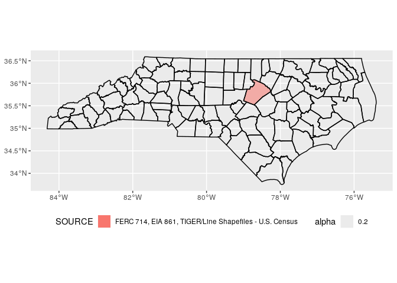

``` r
nc_shp %>% filter(TYPE=="STATE") %>% 
  ggplot() + 
  geom_sf(aes(fill=SOURCE, alpha=.2), color=NA) + 
  geom_sf(data = counties, fill = NA, color = "black") + 
  coord_sf(crs = 4326) + 
  theme(legend.position="bottom") + 
  guides(fill = guide_legend(ncol = 1))
```

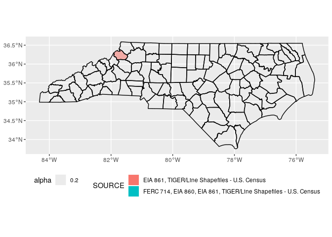

``` r
nc_shp %>% filter(TYPE=="MUNICIPAL") %>% 
  ggplot() + 
  geom_sf(aes(fill=SOURCE, alpha=.2), color=NA) + 
  geom_sf(data = counties, fill = NA, color = "black") + 
  coord_sf(crs = 4326) + 
  theme(legend.position="bottom") + 
  guides(fill = guide_legend(ncol = 1))
```

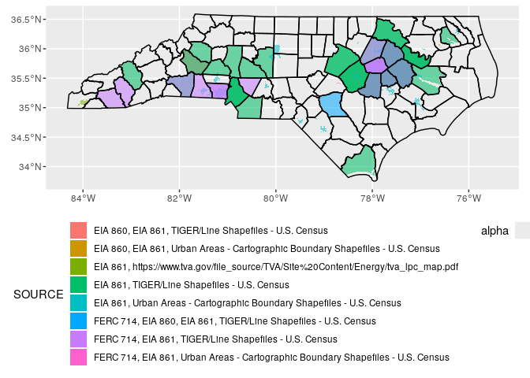

``` r
muni_sources <- c("EIA 861, https://www.tva.gov/file_source/TVA/Site%20Content/Energy/tva_lpc_map.pdf",
             "EIA 861, Urban Areas - Cartographic Boundary Shapefiles - U.S. Census",
             "FERC 714, EIA 861, Urban Areas - Cartographic Boundary Shapefiles - U.S. Census",
             "EIA 860, EIA 861, Urban Areas - Cartographic Boundary Shapefiles - U.S. Census")
nc_shp %>% filter(TYPE=="MUNICIPAL" & SOURCE %in% muni_sources) %>% 
  ggplot() + 
  geom_sf(aes(fill=SOURCE, alpha=.2), color=NA) + 
  geom_sf(data = counties, fill = NA, color = "black") + 
  coord_sf(crs = 4326) + 
  theme(legend.position="bottom") + 
  guides(fill = guide_legend(ncol = 1))
```

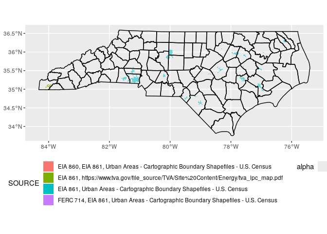

``` r
nc_shp %>% filter(TYPE=="COOPERATIVE") %>% 
  ggplot() + 
  geom_sf(aes(fill=SOURCE, alpha=.2), color=NA) + 
  geom_sf(data = counties, fill = NA, color = "black") + 
  coord_sf(crs = 4326) + 
  theme(legend.position="bottom") + 
  guides(fill = guide_legend(ncol = 1))
```

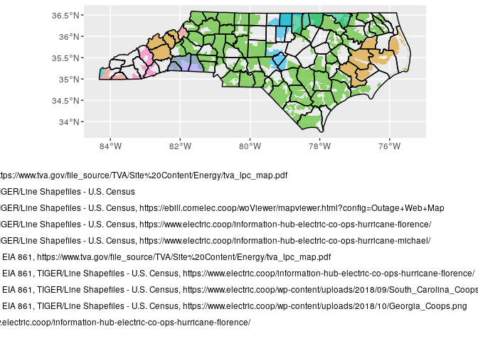

``` r
not_coop_sources <- c("FERC 714, EIA 861, TIGER/Line Shapefiles - U.S. Census, https://www.electric.coop/wp-content/uploads/2018/09/South_Carolina_Coops-1024x791.png",
                      "EIA 861, TIGER/Line Shapefiles - U.S. Census, https://www.electric.coop/information-hub-electric-co-ops-hurricane-michael/")
nc_shp %>% filter(TYPE=="COOPERATIVE" & !(SOURCE %in% not_coop_sources)) %>% 
  ggplot() + 
  geom_sf(aes(fill=SOURCE, alpha=.2), color=NA) + 
  geom_sf(data = counties, fill = NA, color = "black") + 
  coord_sf(crs = 4326) + 
  theme(legend.position="bottom") + 
  guides(fill = guide_legend(ncol = 1))
```

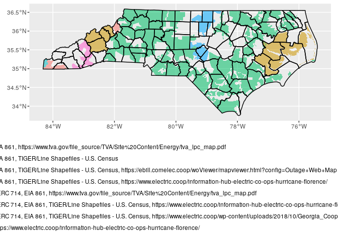

``` r
nc_shp %>% filter(TYPE=="INVESTOR OWNED") %>% 
  ggplot() + 
  geom_sf(aes(fill=SOURCE, alpha=.2), color=NA) + 
  geom_sf(data = counties, fill = NA, color = "black") + 
  coord_sf(crs = 4326) + 
  theme(legend.position="bottom") + 
  guides(fill = guide_legend(ncol = 1))
```

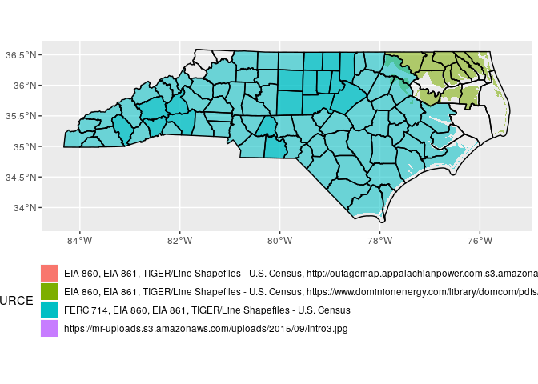

``` r
nc_shp %>% filter(TYPE=="INVESTOR OWNED") %>% 
  ggplot() + 
  geom_sf(aes(fill=NAME, alpha=.2), color=NA) + 
  geom_sf(data = counties, fill = NA, color = "black") + 
  coord_sf(crs = 4326) + 
  theme(legend.position="bottom") + 
  guides(fill = guide_legend(ncol = 1))
```


``` r
# Territory types not applicable to North Carolina
## FEDERAL
## POLITICAL SUBDIVISION
## NOT AVAILABLE
## WHOLESALE POWER MARKETER
# nc_shp %>% filter(TYPE=="") %>% 
#   ggplot() + 
#   geom_sf(aes(fill=SOURCE, alpha=.2), color=NA) + 
#   geom_sf(data = counties, fill = NA, color = "black") + 
#   coord_sf(crs = 4326) + 
#   theme(legend.position="bottom") + 
#   guides(fill = guide_legend(ncol = 1))
```

Select relevant utilities based on analysis above

``` r
nc_shp %>% filter((TYPE=="MUNICIPAL" & SOURCE %in% muni_sources) | 
                                 (TYPE=="COOPERATIVE" & !(SOURCE %in% not_coop_sources)) | 
                                 (TYPE=="INVESTOR OWNED")) %>% 
  ggplot() + 
  geom_sf(aes(fill=TYPE, alpha=.2), color=NA) + 
  #geom_sf(data = counties, fill = NA, color = "black") + 
  coord_sf(crs = 4326) + 
  theme(legend.position="bottom") + 
  guides(fill = guide_legend(ncol = 1))
```

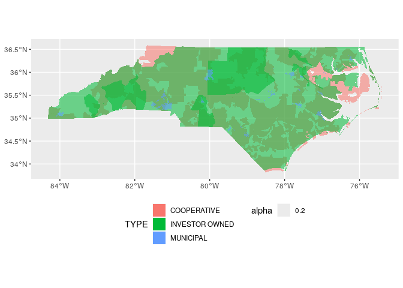

``` r
nc_clean_shp <- subset(nc_shp, (TYPE=="MUNICIPAL" & SOURCE %in% muni_sources) | 
                                 (TYPE=="COOPERATIVE" & !(SOURCE %in% not_coop_sources)) | 
                                 (TYPE=="INVESTOR OWNED"))
```

``` r
nc_clean_shp %>% 
  ggplot() + 
  geom_sf(aes(fill=NAME, alpha=.2), color=NA) + 
  geom_sf(data = states, fill = NA, color = "black") + 
  coord_sf(crs = 4326) +
  theme(legend.position = "none")
```

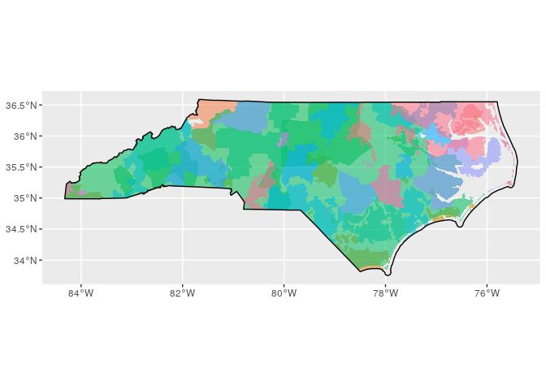

``` r
  #theme(legend.position="bottom") + 
  #guides(fill = guide_legend(ncol = 1))
```

Flatten the service territories for each provider type
------------------------------------------------------

#### Function to assign overlapping areas

``` r
nc_clean_shp %>% filter(TYPE=="INVESTOR OWNED") %>% #st_sf() %>% 
  st_buffer(dist = 0) %>% 
  ggplot() + 
  geom_sf(aes(fill=ID, alpha=.2), color=NA) + 
  geom_sf(data = states, fill = NA, color = "black") + 
  coord_sf(crs = 4326) + 
  theme(legend.position = "none")
```

    ## Warning in st_buffer.sfc(st_geometry(x), dist, nQuadSegs, endCapStyle =
    ## endCapStyle, : st_buffer does not correctly buffer longitude/latitude data

    ## dist is assumed to be in decimal degrees (arc_degrees).

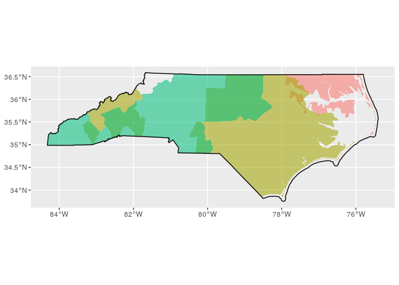

``` r
# https://github.com/r-spatial/sf/issues/824
st_no_overlap <- function(polygons) {
  
  #independent <- b %>% st_sf %>% st_intersection %>% subset(n.overlaps<=1) %>% st_cast("POLYGON")
  #overlap <- b %>% st_sf %>% st_intersection %>% subset(n.overlaps>1) %>% st_union()
  
  centroids <- polygons %>% st_centroid

     # Voronoi tesselation
     voronoi <- 
          centroids %>% 
          st_geometry() %>%
          st_union() %>%
          st_voronoi() %>%
          st_collection_extract()
     
     # Put them back in their original order
     voronoi <-
          voronoi[unlist(st_intersects(centroids,voronoi))]

     # Keep the attributes
     result <- centroids
     
     # Intersect voronoi zones with buffer zones
     st_geometry(result) <-
          mapply(function(x,y) st_intersection(x,y),
                 #st_buffer(st_geometry(centroids),dist), 
                 polygons$geometry,
                 voronoi,
                 SIMPLIFY=FALSE) %>%
          st_sfc(crs=st_crs(centroids))

     result
}

unoverlap_territories <- function(territories, min_area){
  all_polygons <- territories %>% st_cast("MULTIPOLYGON") %>% st_cast("POLYGON") %>% 
    st_buffer(dist = 0) %>% st_set_precision(1e5) %>%  lwgeom::st_make_valid()
  
  all_polygons <- all_polygons[st_area(all_polygons)>min_area,,drop=FALSE]
  
  final_b <- st_no_overlap(all_polygons)
  
  independent <- all_polygons %>% st_sf %>% st_intersection %>% subset(n.overlaps<=1) %>% 
    st_cast("MULTIPOLYGON") %>% st_cast("POLYGON") %>% st_buffer(dist = 0) %>% 
    st_set_precision(1e5) %>%  lwgeom::st_make_valid()
  
  # combine by ID
  combined_territories <- rbind(independent %>% select(names(final_b)), final_b)
  
  # merge independent with final_b by ID
  merged_territories <- combined_territories %>% group_by(ID) %>% 
    summarize() %>% ungroup() %>% st_buffer(dist = 0) %>% 
    st_set_precision(1e5) %>% lwgeom::st_make_valid() %>% 
    st_difference() %>% st_intersection() %>% 
    subset(n.overlaps==1)
  
  nice_merged_territories <- merged_territories %>% st_buffer(dist = 0) %>% st_set_precision(1e5) %>%  lwgeom::st_make_valid()
  
  
  return(nice_merged_territories)
}

#overlap <- all_polygons %>% st_sf %>% st_intersection %>% subset(n.overlaps>1) %>% st_union()

# abort if there are no overlaps
#if(identical(as.numeric(st_area(overlap)), numeric(0))){
#  return(b)
#}
```

### IOUs

``` r
min_area <- st_area(bgs) %>% mean #median

iou_shp <- nc_clean_shp %>% filter(TYPE=="INVESTOR OWNED") %>% st_buffer(dist = 0)
```

    ## Warning in st_buffer.sfc(st_geometry(x), dist, nQuadSegs, endCapStyle =
    ## endCapStyle, : st_buffer does not correctly buffer longitude/latitude data

    ## dist is assumed to be in decimal degrees (arc_degrees).

``` r
nice_ious <- unoverlap_territories(territories = iou_shp,
                                   min_area = min_area)
```

    ## Warning in st_cast.sf(., "POLYGON"): repeating attributes for all sub-geometries
    ## for which they may not be constant

    ## Warning in st_cast.sf(., "POLYGON"): st_buffer does not correctly buffer
    ## longitude/latitude data

    ## dist is assumed to be in decimal degrees (arc_degrees).

    ## Warning in st_centroid.sf(.): st_centroid assumes attributes are constant over
    ## geometries of x

    ## Warning in st_centroid.sfc(st_geometry(x), of_largest_polygon =
    ## of_largest_polygon): st_centroid does not give correct centroids for longitude/
    ## latitude data

    ## Warning in st_voronoi.sfc(.): st_voronoi does not correctly triangulate
    ## longitude/latitude data

    ## although coordinates are longitude/latitude, st_intersects assumes that they are planar

    ## although coordinates are longitude/latitude, st_intersects assumes that they are planar

    ## Warning in st_cast.sf(., "POLYGON"): repeating attributes for all sub-geometries
    ## for which they may not be constant

    ## Warning in st_buffer.sfc(st_geometry(x), dist, nQuadSegs, endCapStyle =
    ## endCapStyle, : st_buffer does not correctly buffer longitude/latitude data

    ## dist is assumed to be in decimal degrees (arc_degrees).

    ## Warning in st_buffer.sfc(st_geometry(x), dist, nQuadSegs, endCapStyle =
    ## endCapStyle, : st_buffer does not correctly buffer longitude/latitude data

    ## dist is assumed to be in decimal degrees (arc_degrees).

    ## Warning in st_buffer.sfc(st_geometry(x), dist, nQuadSegs, endCapStyle =
    ## endCapStyle, : st_buffer does not correctly buffer longitude/latitude data

    ## dist is assumed to be in decimal degrees (arc_degrees).

``` r
nice_ious %>% 
  ggplot() + 
  geom_sf(aes(fill=ID, alpha=.2), color="red") + 
  #geom_sf(data = states, fill = NA, color = "black") + 
  coord_sf(crs = 4326) + 
  theme(legend.position = "bottom")
```

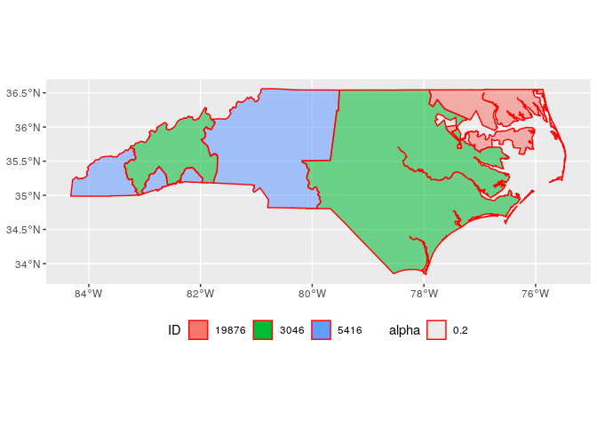

### Muni’s

``` r
nc_clean_shp %>% filter(TYPE=="MUNICIPAL") %>% 
  ggplot() + 
  geom_sf(aes(fill=NAME, alpha=.2), color=NA) + 
  geom_sf(data = states, fill = NA, color = "black") + 
  coord_sf(crs = 4326) + 
  #theme(legend.position = "none")
  theme(legend.position="bottom")# + 
```

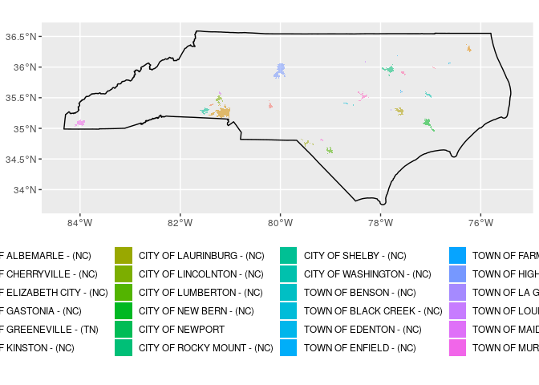

``` r
  #guides(fill = guide_legend(ncol = 1))
```

``` r
muni_shp <- nc_clean_shp %>% filter(TYPE=="MUNICIPAL") %>% st_buffer(dist = 0)
```

    ## Warning in st_buffer.sfc(st_geometry(x), dist, nQuadSegs, endCapStyle =
    ## endCapStyle, : st_buffer does not correctly buffer longitude/latitude data

    ## dist is assumed to be in decimal degrees (arc_degrees).

``` r
nice_munis <- unoverlap_territories(territories = muni_shp,
                                   min_area = min_area)
```

    ## Warning in st_cast.sf(., "POLYGON"): repeating attributes for all sub-geometries
    ## for which they may not be constant

    ## Warning in st_cast.sf(., "POLYGON"): st_buffer does not correctly buffer
    ## longitude/latitude data

    ## dist is assumed to be in decimal degrees (arc_degrees).

    ## Warning in st_centroid.sf(.): st_centroid assumes attributes are constant over
    ## geometries of x

    ## Warning in st_centroid.sfc(st_geometry(x), of_largest_polygon =
    ## of_largest_polygon): st_centroid does not give correct centroids for longitude/
    ## latitude data

    ## Warning in st_voronoi.sfc(.): st_voronoi does not correctly triangulate
    ## longitude/latitude data

    ## although coordinates are longitude/latitude, st_intersects assumes that they are planar

    ## although coordinates are longitude/latitude, st_intersects assumes that they are planar

    ## Warning in st_cast.sf(., "POLYGON"): repeating attributes for all sub-geometries
    ## for which they may not be constant

    ## Warning in st_buffer.sfc(st_geometry(x), dist, nQuadSegs, endCapStyle =
    ## endCapStyle, : st_buffer does not correctly buffer longitude/latitude data

    ## dist is assumed to be in decimal degrees (arc_degrees).

    ## Warning in st_buffer.sfc(st_geometry(x), dist, nQuadSegs, endCapStyle =
    ## endCapStyle, : st_buffer does not correctly buffer longitude/latitude data

    ## dist is assumed to be in decimal degrees (arc_degrees).

    ## Warning in st_buffer.sfc(st_geometry(x), dist, nQuadSegs, endCapStyle =
    ## endCapStyle, : st_buffer does not correctly buffer longitude/latitude data

    ## dist is assumed to be in decimal degrees (arc_degrees).

``` r
nice_munis %>% 
  ggplot() + 
  geom_sf(aes(fill=ID, alpha=.2), color="red") + 
  #geom_sf(data = states, fill = NA, color = "black") + 
  coord_sf(crs = 4326) + 
  theme(legend.position = "bottom")
```

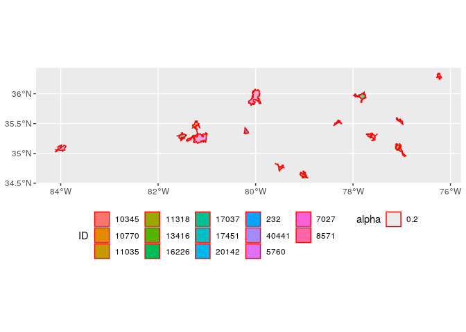

### Coops

``` r
nc_clean_shp %>% filter(TYPE=="COOPERATIVE") %>% #st_sf() %>% 
  st_buffer(dist = 0) %>% 
  ggplot() + 
  geom_sf(aes(fill=NAME, alpha=.2), color=NA) + 
  geom_sf(data = states, fill = NA, color = "black") + 
  coord_sf(crs = 4326) + 
  #theme(legend.position = "none")
  theme(legend.position="bottom")# + 
```

    ## Warning in st_buffer.sfc(st_geometry(x), dist, nQuadSegs, endCapStyle =
    ## endCapStyle, : st_buffer does not correctly buffer longitude/latitude data

    ## dist is assumed to be in decimal degrees (arc_degrees).

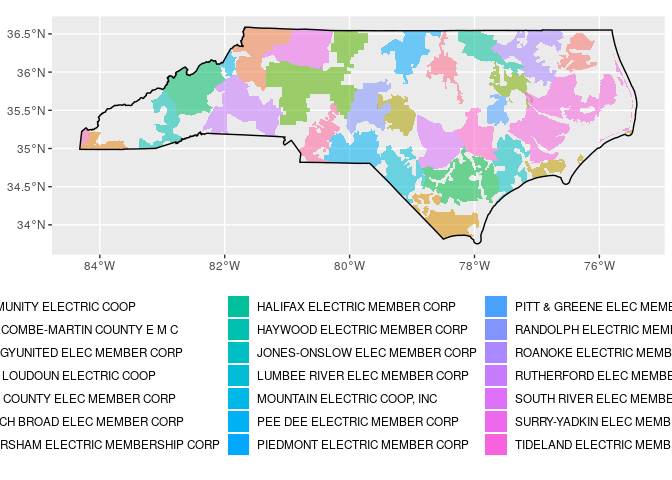

``` r
  #guides(fill = guide_legend(ncol = 1))
```

``` r
coop_shp <- nc_clean_shp %>% filter(TYPE=="COOPERATIVE") %>% st_buffer(dist = 0)
```

    ## Warning in st_buffer.sfc(st_geometry(x), dist, nQuadSegs, endCapStyle =
    ## endCapStyle, : st_buffer does not correctly buffer longitude/latitude data

    ## dist is assumed to be in decimal degrees (arc_degrees).

``` r
nice_coops <- unoverlap_territories(territories = coop_shp,
                                   min_area = min_area)
```

    ## Warning in st_cast.sf(., "POLYGON"): repeating attributes for all sub-geometries
    ## for which they may not be constant

    ## Warning in st_cast.sf(., "POLYGON"): st_buffer does not correctly buffer
    ## longitude/latitude data

    ## dist is assumed to be in decimal degrees (arc_degrees).

    ## Warning in st_centroid.sf(.): st_centroid assumes attributes are constant over
    ## geometries of x

    ## Warning in st_centroid.sfc(st_geometry(x), of_largest_polygon =
    ## of_largest_polygon): st_centroid does not give correct centroids for longitude/
    ## latitude data

    ## Warning in st_voronoi.sfc(.): st_voronoi does not correctly triangulate
    ## longitude/latitude data

    ## although coordinates are longitude/latitude, st_intersects assumes that they are planar

    ## although coordinates are longitude/latitude, st_intersects assumes that they are planar

    ## Warning in st_cast.sf(., "POLYGON"): repeating attributes for all sub-geometries
    ## for which they may not be constant

    ## Warning in st_buffer.sfc(st_geometry(x), dist, nQuadSegs, endCapStyle =
    ## endCapStyle, : st_buffer does not correctly buffer longitude/latitude data

    ## dist is assumed to be in decimal degrees (arc_degrees).

    ## Warning in st_buffer.sfc(st_geometry(x), dist, nQuadSegs, endCapStyle =
    ## endCapStyle, : st_buffer does not correctly buffer longitude/latitude data

    ## dist is assumed to be in decimal degrees (arc_degrees).

    ## Warning in st_buffer.sfc(st_geometry(x), dist, nQuadSegs, endCapStyle =
    ## endCapStyle, : st_buffer does not correctly buffer longitude/latitude data

    ## dist is assumed to be in decimal degrees (arc_degrees).

``` r
nice_coops %>% 
  ggplot() + 
  geom_sf(aes(fill=ID, alpha=.2), color="red") + 
  #geom_sf(data = states, fill = NA, color = "black") + 
  coord_sf(crs = 4326) + 
  theme(legend.position = "bottom")
```

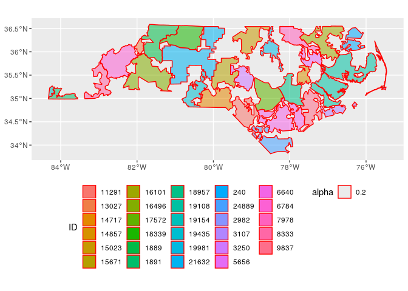

### Combine All Territories Together

``` r
combine_territories <- function(t_front, t_back){
  t_front_polygons <- t_front %>% st_cast("MULTIPOLYGON") %>% st_cast("POLYGON") %>% 
    st_buffer(dist = 0) %>% st_set_precision(1e5) %>%  lwgeom::st_make_valid()
  
  t_back_polygons <- t_back %>% st_cast("MULTIPOLYGON") %>% st_cast("POLYGON") %>% 
    st_buffer(dist = 0) %>% st_set_precision(1e5) %>%  lwgeom::st_make_valid()
  #final_b <- st_no_overlap(all_polygons)
  #final_b <- st_intersect()
  
  back_independent <- st_difference(st_union(t_back_polygons), st_union(t_front_polygons))# %>% 
    #st_cast("MULTIPOLYGON") %>% st_cast("POLYGON")
  
  t_back_independent <- st_intersection(t_back_polygons, back_independent) %>% 
    subset(n.overlaps<=1) %>% st_set_precision(1e5) %>%  lwgeom::st_make_valid() %>% st_buffer(dist = 0)
    #st_intersection(t_back_polygons, st_difference(st_union(t_back_polygons), st_union(t_front_polygons))) %>% 
    #subset(n.overlaps<=1)# %>% 
    #st_cast("MULTIPOLYGON") %>% st_cast("POLYGON") %>% 
    #st_buffer(dist = 0) %>% st_set_precision(1e5) %>%  lwgeom::st_make_valid()
  
  # combine by ID
  combined_territories <- rbind(t_back_independent %>% select(names(t_front)), t_front)
  
  # merge independent with final_b by ID
  merged_territories <- combined_territories %>% group_by(ID) %>% 
    summarize() %>% ungroup() %>% st_buffer(dist = 0) %>% 
    st_set_precision(1e5) %>% lwgeom::st_make_valid() %>% 
    st_difference() %>% st_intersection() %>% 
    subset(n.overlaps==1)
  
  nice_merged_territories <- merged_territories %>% st_buffer(dist = 0) %>% st_set_precision(1e5) %>%  lwgeom::st_make_valid()
  
  
  return(nice_merged_territories)
}

combined_muni_coops <- combine_territories(nice_munis, nice_coops)
```

    ## Warning in st_cast.sf(., "POLYGON"): repeating attributes for all sub-geometries
    ## for which they may not be constant

    ## Warning in st_buffer.sfc(st_geometry(x), dist, nQuadSegs, endCapStyle =
    ## endCapStyle, : st_buffer does not correctly buffer longitude/latitude data

    ## dist is assumed to be in decimal degrees (arc_degrees).

    ## Warning in st_cast.GEOMETRYCOLLECTION(X[[i]], ...): only first part of
    ## geometrycollection is retained

    ## Warning in st_cast.GEOMETRYCOLLECTION(X[[i]], ...): only first part of
    ## geometrycollection is retained

    ## Warning in st_cast.GEOMETRYCOLLECTION(X[[i]], ...): only first part of
    ## geometrycollection is retained

    ## Warning in st_cast.GEOMETRYCOLLECTION(X[[i]], ...): only first part of
    ## geometrycollection is retained

    ## Warning in st_cast.GEOMETRYCOLLECTION(X[[i]], ...): only first part of
    ## geometrycollection is retained

    ## Warning in st_cast.GEOMETRYCOLLECTION(X[[i]], ...): only first part of
    ## geometrycollection is retained

    ## Warning in st_cast.GEOMETRYCOLLECTION(X[[i]], ...): only first part of
    ## geometrycollection is retained

    ## Warning in st_cast.GEOMETRYCOLLECTION(X[[i]], ...): only first part of
    ## geometrycollection is retained

    ## Warning in st_cast.GEOMETRYCOLLECTION(X[[i]], ...): only first part of
    ## geometrycollection is retained

    ## Warning in st_cast.GEOMETRYCOLLECTION(X[[i]], ...): only first part of
    ## geometrycollection is retained

    ## Warning in st_cast.GEOMETRYCOLLECTION(X[[i]], ...): only first part of
    ## geometrycollection is retained

    ## Warning in st_cast.sf(., "POLYGON"): repeating attributes for all sub-geometries
    ## for which they may not be constant

    ## Warning in st_buffer.sfc(st_geometry(x), dist, nQuadSegs, endCapStyle =
    ## endCapStyle, : st_buffer does not correctly buffer longitude/latitude data

    ## dist is assumed to be in decimal degrees (arc_degrees).

    ## although coordinates are longitude/latitude, st_difference assumes that they are planar

    ## although coordinates are longitude/latitude, st_intersection assumes that they are planar

    ## Warning: attribute variables are assumed to be spatially constant throughout all
    ## geometries

    ## Warning: st_buffer does not correctly buffer longitude/latitude data

    ## dist is assumed to be in decimal degrees (arc_degrees).

    ## Warning in st_buffer.sfc(st_geometry(x), dist, nQuadSegs, endCapStyle =
    ## endCapStyle, : st_buffer does not correctly buffer longitude/latitude data

    ## dist is assumed to be in decimal degrees (arc_degrees).

    ## Warning in st_buffer.sfc(st_geometry(x), dist, nQuadSegs, endCapStyle =
    ## endCapStyle, : st_buffer does not correctly buffer longitude/latitude data

    ## dist is assumed to be in decimal degrees (arc_degrees).

``` r
combined_coop_ious <- combine_territories(nice_coops, nice_ious)
```

    ## Warning in st_cast.GEOMETRYCOLLECTION(X[[i]], ...): only first part of
    ## geometrycollection is retained

    ## Warning in st_cast.GEOMETRYCOLLECTION(X[[i]], ...): only first part of
    ## geometrycollection is retained

    ## Warning in st_cast.GEOMETRYCOLLECTION(X[[i]], ...): only first part of
    ## geometrycollection is retained

    ## Warning in st_cast.GEOMETRYCOLLECTION(X[[i]], ...): only first part of
    ## geometrycollection is retained

    ## Warning in st_cast.GEOMETRYCOLLECTION(X[[i]], ...): only first part of
    ## geometrycollection is retained

    ## Warning in st_cast.GEOMETRYCOLLECTION(X[[i]], ...): only first part of
    ## geometrycollection is retained

    ## Warning in st_cast.GEOMETRYCOLLECTION(X[[i]], ...): only first part of
    ## geometrycollection is retained

    ## Warning in st_cast.GEOMETRYCOLLECTION(X[[i]], ...): only first part of
    ## geometrycollection is retained

    ## Warning in st_cast.GEOMETRYCOLLECTION(X[[i]], ...): only first part of
    ## geometrycollection is retained

    ## Warning in st_cast.GEOMETRYCOLLECTION(X[[i]], ...): only first part of
    ## geometrycollection is retained

    ## Warning in st_cast.GEOMETRYCOLLECTION(X[[i]], ...): only first part of
    ## geometrycollection is retained

    ## Warning in st_cast.sf(., "POLYGON"): repeating attributes for all sub-geometries
    ## for which they may not be constant

    ## Warning in st_buffer.sfc(st_geometry(x), dist, nQuadSegs, endCapStyle =
    ## endCapStyle, : st_buffer does not correctly buffer longitude/latitude data

    ## dist is assumed to be in decimal degrees (arc_degrees).

    ## Warning in st_cast.GEOMETRYCOLLECTION(X[[i]], ...): only first part of
    ## geometrycollection is retained

    ## Warning in st_cast.GEOMETRYCOLLECTION(X[[i]], ...): only first part of
    ## geometrycollection is retained

    ## Warning in st_cast.sf(., "POLYGON"): repeating attributes for all sub-geometries
    ## for which they may not be constant

    ## Warning in st_buffer.sfc(st_geometry(x), dist, nQuadSegs, endCapStyle =
    ## endCapStyle, : st_buffer does not correctly buffer longitude/latitude data

    ## dist is assumed to be in decimal degrees (arc_degrees).

    ## although coordinates are longitude/latitude, st_difference assumes that they are planar

    ## although coordinates are longitude/latitude, st_intersection assumes that they are planar

    ## Warning: attribute variables are assumed to be spatially constant throughout all
    ## geometries

    ## Warning: st_buffer does not correctly buffer longitude/latitude data

    ## dist is assumed to be in decimal degrees (arc_degrees).

    ## Warning in st_buffer.sfc(st_geometry(x), dist, nQuadSegs, endCapStyle =
    ## endCapStyle, : st_buffer does not correctly buffer longitude/latitude data

    ## dist is assumed to be in decimal degrees (arc_degrees).

    ## Warning in st_buffer.sfc(st_geometry(x), dist, nQuadSegs, endCapStyle =
    ## endCapStyle, : st_buffer does not correctly buffer longitude/latitude data

    ## dist is assumed to be in decimal degrees (arc_degrees).

``` r
#full_combine <- combine_territories(combined_muni_coops, nice_ious)
full_combine <- combine_territories(nice_munis, combined_coop_ious)
```

    ## Warning in st_cast.sf(., "POLYGON"): repeating attributes for all sub-geometries
    ## for which they may not be constant

    ## Warning in st_cast.sf(., "POLYGON"): st_buffer does not correctly buffer
    ## longitude/latitude data

    ## dist is assumed to be in decimal degrees (arc_degrees).

    ## Warning in st_cast.GEOMETRYCOLLECTION(X[[i]], ...): only first part of
    ## geometrycollection is retained

    ## Warning in st_cast.GEOMETRYCOLLECTION(X[[i]], ...): only first part of
    ## geometrycollection is retained

    ## Warning in st_cast.GEOMETRYCOLLECTION(X[[i]], ...): only first part of
    ## geometrycollection is retained

    ## Warning in st_cast.GEOMETRYCOLLECTION(X[[i]], ...): only first part of
    ## geometrycollection is retained

    ## Warning in st_cast.GEOMETRYCOLLECTION(X[[i]], ...): only first part of
    ## geometrycollection is retained

    ## Warning in st_cast.GEOMETRYCOLLECTION(X[[i]], ...): only first part of
    ## geometrycollection is retained

    ## Warning in st_cast.GEOMETRYCOLLECTION(X[[i]], ...): only first part of
    ## geometrycollection is retained

    ## Warning in st_cast.GEOMETRYCOLLECTION(X[[i]], ...): only first part of
    ## geometrycollection is retained

    ## Warning in st_cast.GEOMETRYCOLLECTION(X[[i]], ...): only first part of
    ## geometrycollection is retained

    ## Warning in st_cast.GEOMETRYCOLLECTION(X[[i]], ...): only first part of
    ## geometrycollection is retained

    ## Warning in st_cast.GEOMETRYCOLLECTION(X[[i]], ...): only first part of
    ## geometrycollection is retained

    ## Warning in st_cast.GEOMETRYCOLLECTION(X[[i]], ...): only first part of
    ## geometrycollection is retained

    ## Warning in st_cast.GEOMETRYCOLLECTION(X[[i]], ...): only first part of
    ## geometrycollection is retained

    ## Warning in st_cast.GEOMETRYCOLLECTION(X[[i]], ...): only first part of
    ## geometrycollection is retained

    ## Warning in st_cast.GEOMETRYCOLLECTION(X[[i]], ...): only first part of
    ## geometrycollection is retained

    ## Warning in st_cast.GEOMETRYCOLLECTION(X[[i]], ...): only first part of
    ## geometrycollection is retained

    ## Warning in st_cast.GEOMETRYCOLLECTION(X[[i]], ...): only first part of
    ## geometrycollection is retained

    ## Warning in st_cast.GEOMETRYCOLLECTION(X[[i]], ...): only first part of
    ## geometrycollection is retained

    ## Warning in st_cast.GEOMETRYCOLLECTION(X[[i]], ...): only first part of
    ## geometrycollection is retained

    ## Warning in st_cast.sf(., "POLYGON"): repeating attributes for all sub-geometries
    ## for which they may not be constant

    ## Warning in st_buffer.sfc(st_geometry(x), dist, nQuadSegs, endCapStyle =
    ## endCapStyle, : st_buffer does not correctly buffer longitude/latitude data

    ## dist is assumed to be in decimal degrees (arc_degrees).

    ## although coordinates are longitude/latitude, st_difference assumes that they are planar

    ## although coordinates are longitude/latitude, st_intersection assumes that they are planar

    ## Warning: attribute variables are assumed to be spatially constant throughout all
    ## geometries

    ## Warning: st_buffer does not correctly buffer longitude/latitude data

    ## dist is assumed to be in decimal degrees (arc_degrees).

    ## Warning in st_buffer.sfc(st_geometry(x), dist, nQuadSegs, endCapStyle =
    ## endCapStyle, : st_buffer does not correctly buffer longitude/latitude data

    ## dist is assumed to be in decimal degrees (arc_degrees).

    ## Warning in st_buffer.sfc(st_geometry(x), dist, nQuadSegs, endCapStyle =
    ## endCapStyle, : st_buffer does not correctly buffer longitude/latitude data

    ## dist is assumed to be in decimal degrees (arc_degrees).

``` r
full_combine %>% 
  ggplot() + 
  geom_sf(aes(fill=ID, alpha=.2), color=NA) + 
  #geom_sf(data=nice_munis, aes(fill=ID, alpha=.2), color="green") + 
  #geom_sf(data = states, fill = NA, color = "black") + 
  coord_sf(crs = 4326) + 
  theme(legend.position = "bottom")
```

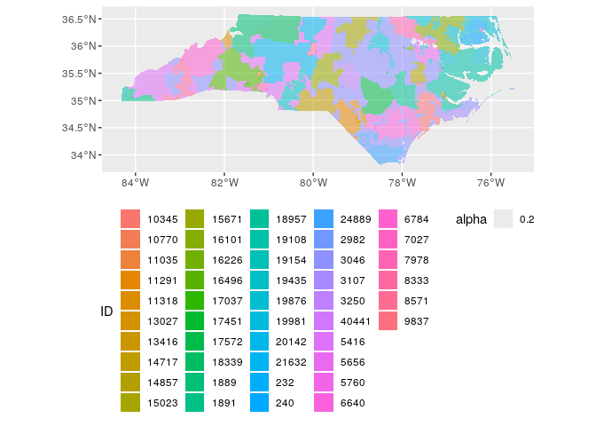

``` r
st_write(full_combine, "full_combined_ersts.geojson", delete_dsn = TRUE)
```

    ## Warning in clean_columns(as.data.frame(obj), factorsAsCharacter): Dropping
    ## column(s) origins of class(es) list

    ## Deleting source `full_combined_ersts.geojson' using driver `GeoJSON'
    ## Writing layer `full_combined_ersts' to data source `full_combined_ersts.geojson' using driver `GeoJSON'
    ## Writing 46 features with 2 fields and geometry type Unknown (any).

Assign each census block group to a service territory
-----------------------------------------------------

``` r
ggplot() + 
  geom_sf(data=full_combine, aes(fill=ID, alpha=.2), color=NA) + 
  geom_sf(data = bgs, fill = NA, color = "blue", size=.1) + 
  geom_sf(data = census_tracts, fill = NA, color = "red", size=.2) + 
  coord_sf(crs = 4326) + 
  theme(legend.position = "none")
```

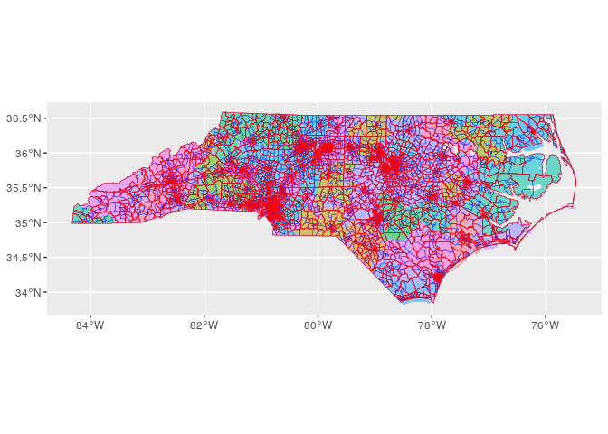

``` r
block_group_utilities <- st_join(bgs, full_combine, left=TRUE, largest=TRUE)
```

    ## although coordinates are longitude/latitude, st_intersection assumes that they are planar

    ## Warning: attribute variables are assumed to be spatially constant throughout all
    ## geometries

``` r
ggplot() + 
  geom_sf(data=block_group_utilities, aes(fill=ID, alpha=.2), color=NA) + 
  #geom_sf(data = bgs, fill = NA, color = "blue", size=.1) + 
  #geom_sf(data = census_tracts, fill = NA, color = "red", size=.2) + 
  coord_sf(crs = 4326) + 
  theme(legend.position = "none")
```


``` r
st_write(block_group_utilities, "block_group_utilities.geojson", delete_dsn = TRUE)
```

    ## Warning in clean_columns(as.data.frame(obj), factorsAsCharacter): Dropping
    ## column(s) origins of class(es) list

    ## Deleting source `block_group_utilities.geojson' using driver `GeoJSON'
    ## Writing layer `block_group_utilities' to data source `block_group_utilities.geojson' using driver `GeoJSON'
    ## Writing 6137 features with 12 fields and geometry type Multi Polygon.

``` r
# B00002_001E   Estimate!!Total UNWEIGHTED SAMPLE HOUSING UNITS
# B25001_001E   Estimate!!Total HOUSING UNITS

# housing_density <- get_acs(state = "NC",
#                            geography = "block group",
#                            variables = c("B25001_001"),
#                            year = 2016,
#                            output = "wide",
#                            geometry = FALSE)

acs_variables <- list(
  total_households = sym("B25001_001")
)

acs_features <- get_acs(state = "NC", 
                    geography = "block group",
                    variables = as.character(unlist(acs_variables)),
                    year = 2016,
                    output = "tidy",
                    geometry = FALSE)
```

    ## Getting data from the 2012-2016 5-year ACS

    ##   |                                                                              |                                                                      |   0%  |                                                                              |=                                                                     |   2%  |                                                                              |==                                                                    |   3%  |                                                                              |===                                                                   |   5%  |                                                                              |====                                                                  |   6%  |                                                                              |=====                                                                 |   8%  |                                                                              |======                                                                |   9%  |                                                                              |=======                                                               |  10%  |                                                                              |========                                                              |  11%  |                                                                              |=========                                                             |  13%  |                                                                              |==========                                                            |  14%  |                                                                              |===========                                                           |  16%  |                                                                              |=============                                                         |  18%  |                                                                              |==============                                                        |  20%  |                                                                              |===============                                                       |  22%  |                                                                              |=================                                                     |  24%  |                                                                              |==================                                                    |  26%  |                                                                              |===================                                                   |  27%  |                                                                              |====================                                                  |  29%  |                                                                              |=====================                                                 |  30%  |                                                                              |======================                                                |  31%  |                                                                              |=======================                                               |  33%  |                                                                              |========================                                              |  34%  |                                                                              |=========================                                             |  36%  |                                                                              |==========================                                            |  37%  |                                                                              |===========================                                           |  39%  |                                                                              |============================                                          |  41%  |                                                                              |=============================                                         |  42%  |                                                                              |==============================                                        |  43%  |                                                                              |===============================                                       |  44%  |                                                                              |================================                                      |  46%  |                                                                              |==================================                                    |  48%  |                                                                              |==================================                                    |  49%  |                                                                              |====================================                                  |  51%  |                                                                              |====================================                                  |  52%  |                                                                              |======================================                                |  54%  |                                                                              |=======================================                               |  55%  |                                                                              |=======================================                               |  56%  |                                                                              |=========================================                             |  58%  |                                                                              |=========================================                             |  59%  |                                                                              |===========================================                           |  61%  |                                                                              |============================================                          |  63%  |                                                                              |=============================================                         |  65%  |                                                                              |==============================================                        |  66%  |                                                                              |===============================================                       |  68%  |                                                                              |================================================                      |  69%  |                                                                              |=================================================                     |  70%  |                                                                              |==================================================                    |  71%  |                                                                              |===================================================                   |  73%  |                                                                              |====================================================                  |  74%  |                                                                              |=====================================================                 |  76%  |                                                                              |======================================================                |  77%  |                                                                              |=======================================================               |  79%  |                                                                              |========================================================              |  80%  |                                                                              |=========================================================             |  82%  |                                                                              |==========================================================            |  83%  |                                                                              |===========================================================           |  84%  |                                                                              |============================================================          |  86%  |                                                                              |=============================================================         |  87%  |                                                                              |==============================================================        |  89%  |                                                                              |================================================================      |  91%  |                                                                              |=================================================================     |  93%  |                                                                              |==================================================================    |  94%  |                                                                              |===================================================================   |  95%  |                                                                              |====================================================================  |  97%  |                                                                              |===================================================================== |  98%  |                                                                              |======================================================================| 100%

``` r
acs_features <- pivot_wider(acs_features, id_cols=c("GEOID"),
                            names_from=c("variable"),
                            #names_prefix = "acs_",
                            values_from=c("estimate"))

acs_features <- rename(acs_features, !!!acs_variables)
head(acs_features)
```

    ## # A tibble: 6 x 2
    ##   GEOID        total_households
    ##   <chr>                   <dbl>
    ## 1 371290101001              447
    ## 2 371290101002              362
    ## 3 371290101003              463
    ## 4 371290102001              592
    ## 5 371290102002              786
    ## 6 371290102003              345

``` r
acs_block_group_utilities <- st_sf(left_join(acs_features, block_group_utilities, by="GEOID"))

acs_block_group_utilities %>% filter(is.na(ID)) %>% summarise(covered=sum(total_households))
```

    ## Simple feature collection with 1 feature and 1 field
    ## geometry type:  MULTIPOLYGON
    ## dimension:      XY
    ## bbox:           xmin: -81.82336 ymin: 35.18771 xmax: -75.46062 ymax: 36.26606
    ## CRS:            4326
    ## # A tibble: 1 x 2
    ##   covered                                                               geometry
    ##     <dbl>                                                     <MULTIPOLYGON [°]>
    ## 1    7883 (((-75.75613 35.18955, -75.75421 35.19019, -75.75068 35.18938, -75.75…

``` r
acs_block_group_utilities %>% filter(is.na(ID)) %>% 
  ggplot() +
  geom_sf(aes(fill="red", alpha=.2), color="blue", size=.2) + 
  geom_sf(data = bgs, fill = NA, color = "blue", size=.1) + 
  #geom_sf(data = census_tracts, fill = NA, color = "red", size=.2) + 
  coord_sf(crs = 4326) + 
  theme(legend.position = "none")
```

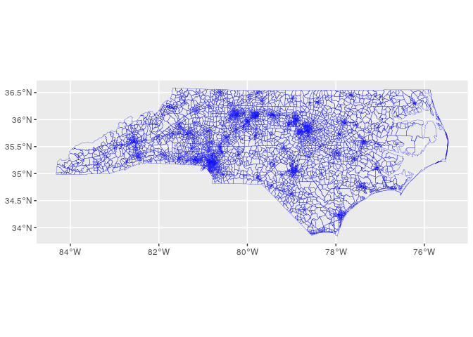

``` r
tract_utilities <- acs_block_group_utilities %>% st_set_geometry(NULL) %>% mutate(ID=fct_explicit_na(ID)) %>% 
  group_by(TRACTCE, ID) %>% 
  summarise(tract_households_served = sum(total_households)) %>% 
  left_join(acs_block_group_utilities %>% st_set_geometry(NULL) %>% group_by(TRACTCE) %>% 
              summarise(tract_households = sum(total_households)), by="TRACTCE") %>% 
  mutate(percent_tract_served = tract_households_served / tract_households) %>% 
  group_by(TRACTCE) %>% slice(which.max(percent_tract_served))# %>% 
  #arrange((percent_tract_served)) %>% head(50)# slice(1:10)
```

``` r
left_join(census_tracts, tract_utilities %>% filter(ID=="(Missing)"), by="TRACTCE") %>% 
  ggplot() +
  geom_sf(aes(fill=ID, alpha=.2), color="blue", size=.2) + 
  #geom_sf(data = bgs, fill = NA, color = "blue", size=.1) + 
  #geom_sf(data = census_tracts, fill = NA, color = "red", size=.2) + 
  coord_sf(crs = 4326) + 
  theme(legend.position = "none")
```

``` r
left_join(census_tracts, tract_utilities %>% filter(percent_tract_served<.5), by="TRACTCE") %>% 
  ggplot() +
  geom_sf(aes(fill=ID, alpha=.2), color="blue", size=.2) + 
  #geom_sf(data = bgs, fill = NA, color = "blue", size=.1) + 
  #geom_sf(data = census_tracts, fill = NA, color = "red", size=.2) + 
  coord_sf(crs = 4326) + 
  theme(legend.position = "none")
```

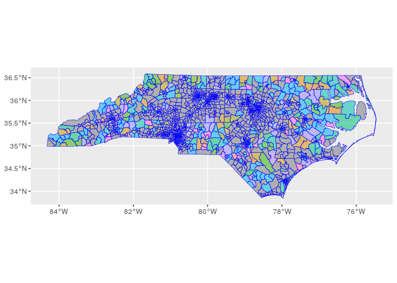

``` r
# Percent of households in a tract that is served entirely by 1 utility
sum((tract_utilities$percent_tract_served==1) * tract_utilities$tract_households_served)/sum(tract_utilities$tract_households)
```

    ## [1] 0.4451075

``` r
# Percent of households served by the utility assigned to their tract
sum(tract_utilities$tract_households_served)/sum(tract_utilities$tract_households)
```

    ## [1] 0.7072561

``` r
left_join(census_tracts, tract_utilities, by="TRACTCE") %>% 
  ggplot() +
  geom_sf(aes(fill=percent_tract_served), color="blue", size=.2) + 
  #geom_sf(data = bgs, fill = NA, color = "blue", size=.1) + 
  #geom_sf(data = census_tracts, fill = NA, color = "red", size=.2) + 
  coord_sf(crs = 4326) + 
  theme(legend.position = "top")
```

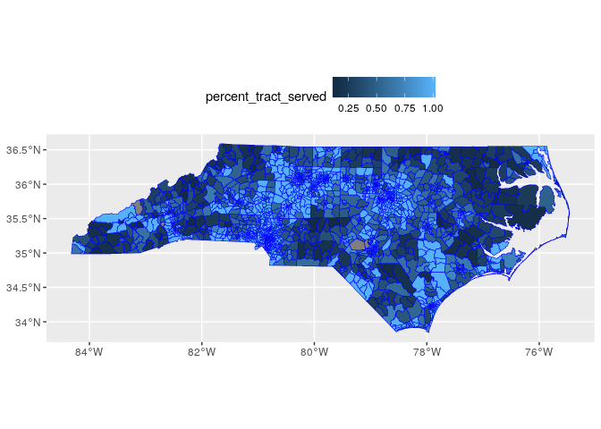

``` r
tract_utilities <- left_join(census_tracts, tract_utilities, by="TRACTCE")
```

Join EIA EIA-861 Data
=====================

``` r
# Download the EIA-861 Data
zip_url <- "https://www.eia.gov/electricity/data/eia861/archive/zip/f8612016.zip"

desired_path <- file.path("Frame_2016.xlsx")

if (!file.exists(desired_path)){
  print(paste0("Downloading ",desired_name))
  temp <- tempfile()
  download.file(zip_url,temp)
  unzip(temp)
  unlink(temp)
}
```

``` r
# Get the sheets we want
# Filter by the variables we want
#desired_fields <- list(Frame=c(Utility Number  Utility Name    Ownership Code  Ownership)
frame <- read_excel(file.path("Frame_2016.xlsx"))
sales <- read_excel(path=file.path("Sales_Ult_Cust_2016.xlsx"),
                    sheet="States",
                    skip=2)
```

    ## Warning in read_fun(path = enc2native(normalizePath(path)), sheet_i = sheet, :
    ## Expecting numeric in V2333 / R2333C22: got '.'

    ## Warning in read_fun(path = enc2native(normalizePath(path)), sheet_i = sheet, :
    ## Expecting numeric in W2333 / R2333C23: got '.'

    ## Warning in read_fun(path = enc2native(normalizePath(path)), sheet_i = sheet, :
    ## Expecting numeric in X2333 / R2333C24: got '.'

    ## Warning in read_fun(path = enc2native(normalizePath(path)), sheet_i = sheet, :
    ## Expecting numeric in V2334 / R2334C22: got '.'

    ## Warning in read_fun(path = enc2native(normalizePath(path)), sheet_i = sheet, :
    ## Expecting numeric in W2334 / R2334C23: got '.'

    ## Warning in read_fun(path = enc2native(normalizePath(path)), sheet_i = sheet, :
    ## Expecting numeric in X2334 / R2334C24: got '.'

    ## Warning in read_fun(path = enc2native(normalizePath(path)), sheet_i = sheet, :
    ## Expecting numeric in V2335 / R2335C22: got '.'

    ## Warning in read_fun(path = enc2native(normalizePath(path)), sheet_i = sheet, :
    ## Expecting numeric in W2335 / R2335C23: got '.'

    ## Warning in read_fun(path = enc2native(normalizePath(path)), sheet_i = sheet, :
    ## Expecting numeric in X2335 / R2335C24: got '.'

    ## Warning in read_fun(path = enc2native(normalizePath(path)), sheet_i = sheet, :
    ## Expecting numeric in V2336 / R2336C22: got '.'

    ## Warning in read_fun(path = enc2native(normalizePath(path)), sheet_i = sheet, :
    ## Expecting numeric in W2336 / R2336C23: got '.'

    ## Warning in read_fun(path = enc2native(normalizePath(path)), sheet_i = sheet, :
    ## Expecting numeric in X2336 / R2336C24: got '.'

    ## Warning in read_fun(path = enc2native(normalizePath(path)), sheet_i = sheet, :
    ## Expecting numeric in V2337 / R2337C22: got '.'

    ## Warning in read_fun(path = enc2native(normalizePath(path)), sheet_i = sheet, :
    ## Expecting numeric in W2337 / R2337C23: got '.'

    ## Warning in read_fun(path = enc2native(normalizePath(path)), sheet_i = sheet, :
    ## Expecting numeric in X2337 / R2337C24: got '.'

    ## Warning in read_fun(path = enc2native(normalizePath(path)), sheet_i = sheet, :
    ## Expecting numeric in V2338 / R2338C22: got '.'

    ## Warning in read_fun(path = enc2native(normalizePath(path)), sheet_i = sheet, :
    ## Expecting numeric in W2338 / R2338C23: got '.'

    ## Warning in read_fun(path = enc2native(normalizePath(path)), sheet_i = sheet, :
    ## Expecting numeric in X2338 / R2338C24: got '.'

    ## Warning in read_fun(path = enc2native(normalizePath(path)), sheet_i = sheet, :
    ## Expecting numeric in V2339 / R2339C22: got '.'

    ## Warning in read_fun(path = enc2native(normalizePath(path)), sheet_i = sheet, :
    ## Expecting numeric in W2339 / R2339C23: got '.'

    ## Warning in read_fun(path = enc2native(normalizePath(path)), sheet_i = sheet, :
    ## Expecting numeric in X2339 / R2339C24: got '.'

    ## Warning in read_fun(path = enc2native(normalizePath(path)), sheet_i = sheet, :
    ## Expecting numeric in V2340 / R2340C22: got '.'

    ## Warning in read_fun(path = enc2native(normalizePath(path)), sheet_i = sheet, :
    ## Expecting numeric in W2340 / R2340C23: got '.'

    ## Warning in read_fun(path = enc2native(normalizePath(path)), sheet_i = sheet, :
    ## Expecting numeric in X2340 / R2340C24: got '.'

    ## Warning in read_fun(path = enc2native(normalizePath(path)), sheet_i = sheet, :
    ## Expecting numeric in V2341 / R2341C22: got '.'

    ## Warning in read_fun(path = enc2native(normalizePath(path)), sheet_i = sheet, :
    ## Expecting numeric in W2341 / R2341C23: got '.'

    ## Warning in read_fun(path = enc2native(normalizePath(path)), sheet_i = sheet, :
    ## Expecting numeric in X2341 / R2341C24: got '.'

    ## Warning in read_fun(path = enc2native(normalizePath(path)), sheet_i = sheet, :
    ## Expecting numeric in V2342 / R2342C22: got '.'

    ## Warning in read_fun(path = enc2native(normalizePath(path)), sheet_i = sheet, :
    ## Expecting numeric in W2342 / R2342C23: got '.'

    ## Warning in read_fun(path = enc2native(normalizePath(path)), sheet_i = sheet, :
    ## Expecting numeric in X2342 / R2342C24: got '.'

    ## Warning in read_fun(path = enc2native(normalizePath(path)), sheet_i = sheet, :
    ## Expecting numeric in V2343 / R2343C22: got '.'

    ## Warning in read_fun(path = enc2native(normalizePath(path)), sheet_i = sheet, :
    ## Expecting numeric in W2343 / R2343C23: got '.'

    ## Warning in read_fun(path = enc2native(normalizePath(path)), sheet_i = sheet, :
    ## Expecting numeric in X2343 / R2343C24: got '.'

    ## Warning in read_fun(path = enc2native(normalizePath(path)), sheet_i = sheet, :
    ## Expecting numeric in V2344 / R2344C22: got '.'

    ## Warning in read_fun(path = enc2native(normalizePath(path)), sheet_i = sheet, :
    ## Expecting numeric in W2344 / R2344C23: got '.'

    ## Warning in read_fun(path = enc2native(normalizePath(path)), sheet_i = sheet, :
    ## Expecting numeric in X2344 / R2344C24: got '.'

    ## Warning in read_fun(path = enc2native(normalizePath(path)), sheet_i = sheet, :
    ## Expecting numeric in V2345 / R2345C22: got '.'

    ## Warning in read_fun(path = enc2native(normalizePath(path)), sheet_i = sheet, :
    ## Expecting numeric in W2345 / R2345C23: got '.'

    ## Warning in read_fun(path = enc2native(normalizePath(path)), sheet_i = sheet, :
    ## Expecting numeric in X2345 / R2345C24: got '.'

    ## Warning in read_fun(path = enc2native(normalizePath(path)), sheet_i = sheet, :
    ## Expecting numeric in V2346 / R2346C22: got '.'

    ## Warning in read_fun(path = enc2native(normalizePath(path)), sheet_i = sheet, :
    ## Expecting numeric in W2346 / R2346C23: got '.'

    ## Warning in read_fun(path = enc2native(normalizePath(path)), sheet_i = sheet, :
    ## Expecting numeric in X2346 / R2346C24: got '.'

    ## Warning in read_fun(path = enc2native(normalizePath(path)), sheet_i = sheet, : Expecting numeric in A3315 / R3315C1: got 'To calculate a state or the US total, sum Parts (A,B,C & D) for Revenue, but only Parts (A,B & D) for Sales and Customers.
    ## To avoid double counting of customers, the aggregated customer counts for the states and US do not include the customer count for respondents with ownership code 'Behind the Meter'.
    ## This group consists of Third Party Owners of rooftop solar systems.'

    ## New names:
    ## * `Thousand Dollars` -> `Thousand Dollars...10`
    ## * Megawatthours -> Megawatthours...11
    ## * Count -> Count...12
    ## * `Thousand Dollars` -> `Thousand Dollars...13`
    ## * Megawatthours -> Megawatthours...14
    ## * ...

``` r
# Ownership Type
frame <- select(frame,
               `Utility Number`,
               `Utility Name`,
               `Ownership`,
               `Short Form`,
               `Sales to Ultimate Customers`)

frame <- rename(frame,
               ID=`Utility Number`,
               utility_name=`Utility Name`,
               ownership_type=`Ownership`) %>% 
  mutate(ID=as.factor(ID))

type <- select(frame, `ID`,`utility_name`, `ownership_type`)
```

``` r
## Retail Price
## Retail Customers
## Retail Load

sales <- sales %>% select(ID=`Utility Number`,
                          utility_name=`Utility Name`,
                          ownership_type=`Ownership`,
                 part=`Part`,
                 service_type=`Service Type`,
                 imputed=`Data Type\r\nO = Observed\r\nI = Imputed`,
                 state=`State`,
                 balancing_authority=`BA_CODE`,
                 retail_revenue_thousands=`Thousand Dollars...10`,
                 retail_sales_MWh=`Megawatthours...11`,
                 retail_customers=`Count...12`) %>% 
  filter(ID!=99999, retail_revenue_thousands!=0) %>%  
  mutate(ID=as.character(ID),
                  imputed=if_else(imputed=="O",FALSE,TRUE,NA),
                  retail_revenue_thousands=as.numeric(retail_revenue_thousands),
                  retail_sales_MWh=as.numeric(retail_sales_MWh),
                  retail_customers=as.numeric(retail_customers),
                  implied_price_kWh=retail_revenue_thousands/retail_sales_MWh,
                  revenue_per_customer=retail_revenue_thousands/(1000*retail_customers))
```

    ## Warning: NAs introduced by coercion

    ## Warning: NAs introduced by coercion

    ## Warning: NAs introduced by coercion

``` r
state_sales <- sales %>% filter(state=="NC")
```

``` r
ggplot(state_sales, aes(x=implied_price_kWh, color=ownership_type, fill=ownership_type)) + 
  geom_histogram(binwidth = 0.005)
```

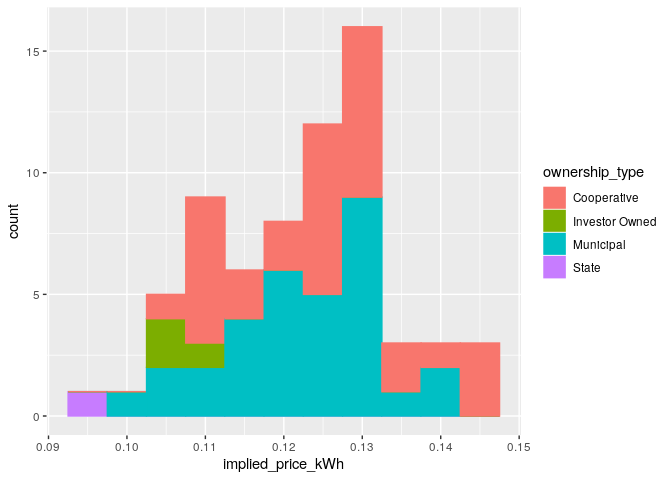

``` r
state_sales %>% filter(ID %in% unique(tract_utilities$ID)) %>%
  ggplot(aes(x=implied_price_kWh, color=ownership_type, fill=ownership_type)) + 
  geom_histogram(binwidth = 0.005)
```


``` r
# Join to tract_utilities based on utility "ID"
tract_utilities <- left_join(tract_utilities, state_sales, by="ID")
```

    ## Warning: Column `ID` joining factor and character vector, coercing into
    ## character vector

``` r
st_write(tract_utilities, "tract_utilities.geojson", delete_dsn = TRUE)
```

    ## Deleting source `tract_utilities.geojson' using driver `GeoJSON'
    ## Writing layer `tract_utilities' to data source `tract_utilities.geojson' using driver `GeoJSON'
    ## Writing 2192 features with 25 fields and geometry type Multi Polygon.

``` r
tract_utilities <- st_read("tract_utilities.geojson")
```

    ## Reading layer `tract_utilities' from data source `/home/ubuntu/environment/leroi/tract_utilities.geojson' using driver `GeoJSON'
    ## Simple feature collection with 2192 features and 25 fields
    ## geometry type:  MULTIPOLYGON
    ## dimension:      XY
    ## bbox:           xmin: -84.32187 ymin: 33.84232 xmax: -75.46062 ymax: 36.58812
    ## CRS:            4326

``` r
tract_utilities %>% 
  ggplot() +
  geom_sf(aes(fill=ownership_type),size=.1) + 
  #geom_sf(data = bgs, fill = NA, color = "blue", size=.1) + 
  geom_sf(data = counties, fill = NA, color = "black", size=.2) + 
  coord_sf(crs = 4326) + 
  theme(legend.position = "top")
```

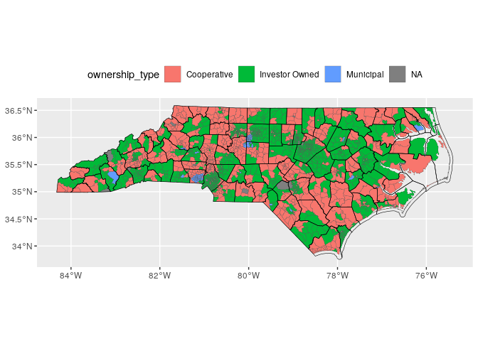

``` r
left_join(census_tracts, tract_utilities, by="TRACTCE") %>% 
  ggplot() +
  geom_sf(aes(fill=utility_name),size=.1) + 
  #geom_sf(data = bgs, fill = NA, color = "blue", size=.1) + 
  #geom_sf(data = census_tracts, fill = NA, color = "red", size=.2) + 
  coord_sf(crs = 4326) + 
  theme(legend.position = "right")
```

``` r
summary(tract_utilities)
```

    ##  STATEFP      COUNTYFP       TRACTCE                     AFFGEOID   
    ##  37:2192   119    : 233   950200 :  11   1400000US37001020100:   1  
    ##            183    : 187   960200 :  10   1400000US37001020200:   1  
    ##            081    : 119   960300 :  10   1400000US37001020300:   1  
    ##            067    :  93   970200 :  10   1400000US37001020400:   1  
    ##            051    :  68   980100 :  10   1400000US37001020501:   1  
    ##            071    :  65   930200 :   9   1400000US37001020502:   1  
    ##            (Other):1427   (Other):2132   (Other)             :2186  
    ##          GEOID           NAME      LSAD          ALAND          
    ##  37001020100:   1   9502   :  11   CT:2192   Min.   :0.000e+00  
    ##  37001020200:   1   9602   :  10             1st Qu.:5.373e+06  
    ##  37001020300:   1   9603   :  10             Median :1.667e+07  
    ##  37001020400:   1   9702   :  10             Mean   :5.745e+07  
    ##  37001020501:   1   9801   :  10             3rd Qu.:7.038e+07  
    ##  37001020502:   1   9302   :   9             Max.   :1.586e+09  
    ##  (Other)    :2186   (Other):2132                                
    ##      AWATER                ID      tract_households_served tract_households
    ##  Min.   :0.000e+00   3046   :783   Min.   :   4            Min.   :    4   
    ##  1st Qu.:8.302e+03   5416   :477   1st Qu.:1712            1st Qu.: 1920   
    ##  Median :9.647e+04   21632  :184   Median :2420            Median : 3341   
    ##  Mean   :5.063e+06   19108  : 56   Mean   :2694            Mean   : 5381   
    ##  3rd Qu.:5.920e+05   6784   : 50   3rd Qu.:3327            3rd Qu.: 6747   
    ##  Max.   :1.531e+09   (Other):621   Max.   :9756            Max.   :27765   
    ##                      NA's   : 21   NA's   :21              NA's   :21      
    ##  percent_tract_served                        utility_name        ownership_type
    ##  Min.   :0.1316       Duke Energy Progress - (NC)  :783   Cooperative   : 774  
    ##  1st Qu.:0.4602       Duke Energy Carolinas, LLC   :477   Investor Owned:1296  
    ##  Median :0.7250       EnergyUnited Elec Member Corp:184   Municipal     :  92  
    ##  Mean   :0.7160       Tideland Electric Member Corp: 56   NA's          :  30  
    ##  3rd Qu.:1.0000       French Broad Elec Member Corp: 50                        
    ##  Max.   :1.0000       (Other)                      :612                        
    ##  NA's   :21           NA's                         : 30                        
    ##    part       service_type   imputed         state      balancing_authority
    ##  A   :2162   Bundled:2162   Mode :logical   NC  :2162   CPLE:1099          
    ##  NA's:  30   NA's   :  30   FALSE:2162      NA's:  30   DUK : 943          
    ##                             NA's :30                    PJM : 110          
    ##                                                         TVA :  10          
    ##                                                         NA's:  30          
    ##                                                                            
    ##                                                                            
    ##  retail_revenue_thousands retail_sales_MWh   retail_customers 
    ##  Min.   :   1563          Min.   :   12288   Min.   :   1295  
    ##  1st Qu.:  86038          1st Qu.:  755230   1st Qu.:  63634  
    ##  Median :1700964          Median :15785056   Median :1162473  
    ##  Mean   :1149510          Mean   :10804921   Mean   : 812289  
    ##  3rd Qu.:1700964          3rd Qu.:15785056   3rd Qu.:1162473  
    ##  Max.   :2251968          Max.   :21615228   Max.   :1669923  
    ##  NA's   :30               NA's   :30         NA's   :30       
    ##  implied_price_kWh revenue_per_customer          geometry   
    ##  Min.   :0.1018    Min.   :0.001105     MULTIPOLYGON :2192  
    ##  1st Qu.:0.1078    1st Qu.:0.001349     epsg:4326    :   0  
    ##  Median :0.1078    Median :0.001463     +proj=long...:   0  
    ##  Mean   :0.1123    Mean   :0.001499                         
    ##  3rd Qu.:0.1128    3rd Qu.:0.001623                         
    ##  Max.   :0.1462    Max.   :0.002074                         
    ##  NA's   :30        NA's   :30

``` r
# Convert Mising IDs back to NA
# ID as factor
# TRACTCE as factor (or even to geoID)
# utility_type as factor

#undo ID=fct_explicit_na(ID)
tract_utilities$ID <- ifelse(!is.na(tract_utilities$ID) & tract_utilities$ID == "(Missing)", NA, tract_utilities$ID)

final_data <- tract_utilities %>% select(tract_id=`TRACTCE`,
                                         utility_id=`ID`,
                                         `tract_households_served`,
                                         `percent_tract_served`,
                                         `utility_name`,
                                         `ownership_type`,
                                         `balancing_authority`,
                                         `retail_revenue_thousands`,
                                         `retail_sales_MWh`,
                                         `retail_customers`,
                                         `implied_price_kWh`,
                                         `revenue_per_customer`) %>% ungroup(tract_id) %>% 
  mutate(tract_id=as.factor(tract_id),
         utility_id=as.factor(utility_id),
         ownership_type=as.factor(ownership_type))


st_write(final_data, "clean_erst.geojson", delete_dsn = TRUE)
```

    ## Deleting source `clean_erst.geojson' using driver `GeoJSON'
    ## Writing layer `clean_erst' to data source `clean_erst.geojson' using driver `GeoJSON'
    ## Writing 2192 features with 12 fields and geometry type Multi Polygon.

``` r
final_data_no_geometry <- st_set_geometry(final_data, NULL)
```

``` r
# Save to csv
write_csv(final_data_no_geometry, "clean_erst.csv")
```

``` r
data_reloaded <- read_csv(file.path(getwd(),"clean_erst.csv"),
                          col_types=cols(
                            tract_id = readr::col_factor(),
                            utility_id = readr::col_factor(),
                            percent_tract_served = readr::col_double(),
                            tract_households_served = readr::col_double(),
                            utility_name = readr::col_character(),
                            ownership_type = readr::col_factor(NULL),
                            balancing_authority = readr::col_factor(NULL),
                            retail_revenue_thousands = readr::col_double(),
                            retail_sales_MWh = readr::col_double(),
                            retail_customers = readr::col_double(),
                            implied_price_kWh = readr::col_double(),
                            revenue_per_customer = readr::col_double()))

all(data_reloaded == final_data_no_geometry, na.rm=TRUE)
```

    ## [1] TRUE
